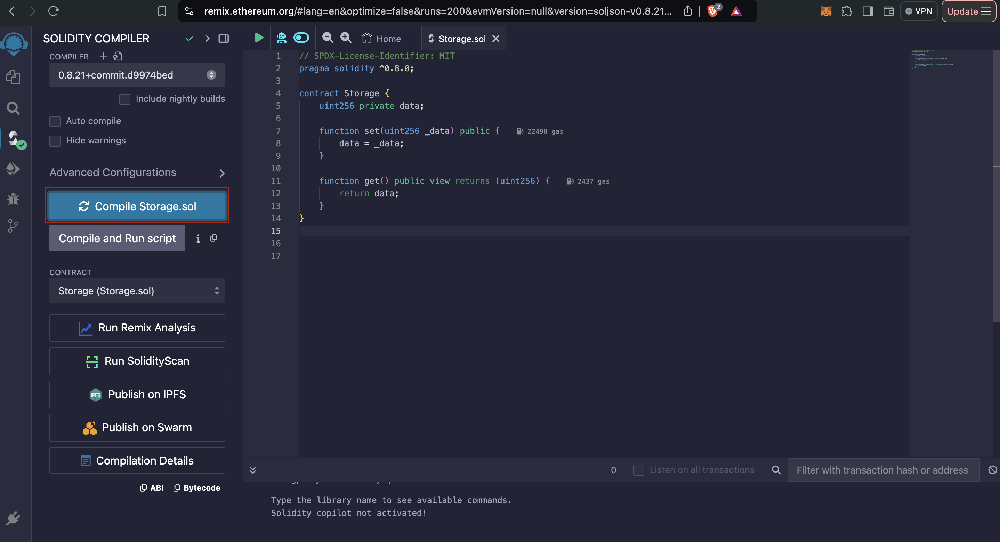
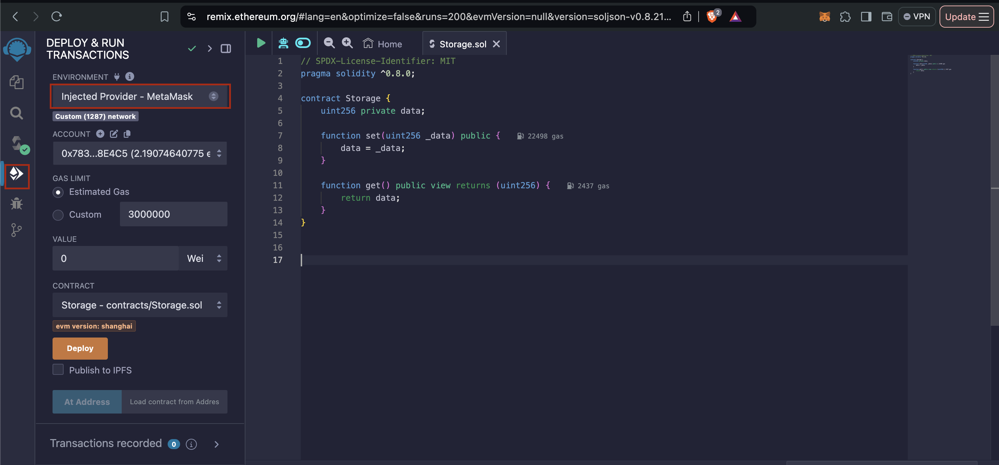
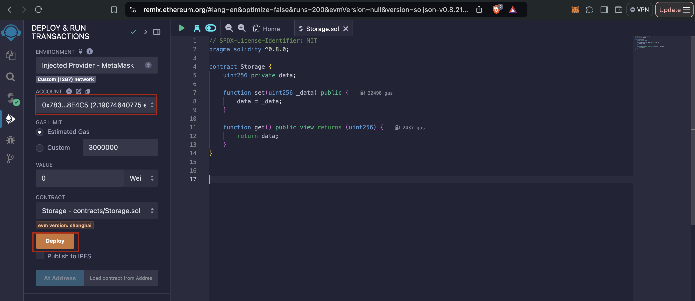
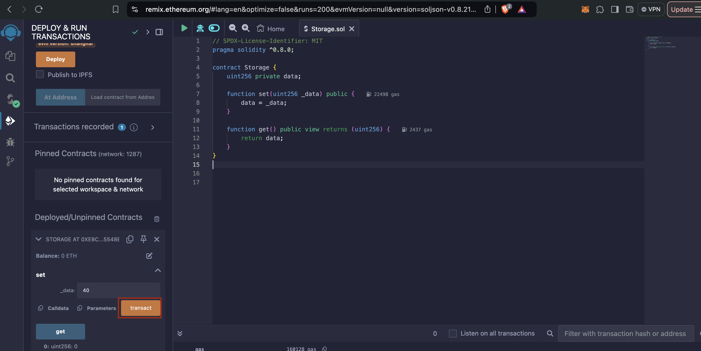

# Tương tác hợp đồng thông minh trên Moonbeam 


## Chuẩn bị các tool hỗ trợ 
 
### RPC Endpoints và cách thêm network vào Metamask

+ RPC endpoints: https://rpc.api.moonbase.moonbeam.network
+ Chain id: 1287


+ Kết nối metamask: https://docs.moonbeam.network/tokens/connect/metamask/

### Faucet coins 

https://faucet.moonbeam.network/

### Remix IDE 

https://remix.ethereum.org/#lang=en&optimize=false&runs=200&evmVersion=null&version=soljson-v0.8.26+commit.8a97fa7a.js


### Contract `Storage` 

```javascript
// SPDX-License-Identifier: MIT
pragma solidity ^0.8.0;

contract Storage {
    uint256 private data;

    // Store a value
    function set(uint256 _data) public {
        data = _data;
    }

    // Retrieve the stored value
    function get() public view returns (uint256) {
        return data;
    }
}
```


## Deploy/Interact Contract trên Moonbeam 

### Compile contract 
#### Sử dụng remix 




#### Sử dụng script
Lưu ý: Cài đặt thư viện
```bash
npm install ethers solc
```

<details>
  <summary>compile.js</summary>
```javascript
const fs = require("fs");
const solc = require("solc");

const source = fs.readFileSync("Storage.sol", "utf8");

const input = {
  language: "Solidity",
  sources: {
    "Storage.sol": {
      content: source,
    },
  },
  settings: {
    outputSelection: {
      "*": {
        "*": ["abi", "evm.bytecode"],
      },
    },
  },
};

const output = JSON.parse(solc.compile(JSON.stringify(input)));
const abi = output.contracts["Storage.sol"].Storage.abi;
const bytecode = output.contracts["Storage.sol"].Storage.evm.bytecode.object;

fs.writeFileSync("StorageABI.json", JSON.stringify(abi));
fs.writeFileSync("StorageBytecode.json", bytecode);
console.log("Contract compiled and ABI/bytecode saved.");
```
</details>


### Deploy contract
#### Sử dụng remix 

1. Chọn `injected provider` là Moonbase 




2. Chọn account và Deploy contract 



3. Metamask sẽ pop up và thực hiện deploy 


#### Sử dụng script


<details>
  <summary>deploy.js</summary>
```javascript
const { ethers } = require("ethers");
const fs = require("fs");

async function main() {
  // Load the ABI and bytecode
  const abi = JSON.parse(fs.readFileSync("StorageABI.json", "utf8"));
  const bytecode = fs.readFileSync("StorageBytecode.json", "utf8");

  // Set up provider and wallet
  const provider = new ethers.JsonRpcProvider("https://rpc.api.moonbase.moonbeam.network");
  const wallet = new ethers.Wallet("your private key", provider);

  const contractFactory = new ethers.ContractFactory(abi, bytecode, wallet);

  const contract = await contractFactory.deploy();

  console.log("Contract deployed at:", contract.target);
}

main().catch((error) => {
  console.error("Error:", error);
  process.exit(1);
});
```
</details>

Kết quả 

```bash
Contract deployed at: 0x7d4567B7257cf869B01a47E8cf0EDB3814bDb963
```


### Kiểm tra địa chỉ contract trên explorer 

https://moonbase.moonscan.io/tx/0xed3507458ecaf40fb67f815cbd70cbbcb9a1d8f4bd001b37839db4a99be14f46


### Tương tác contract 

#### Sử dụng remix 

Remix IDE sẽ show 2 method `set` (WRITE) và `get` (READ) 



#### Sử dụng script


<details>
  <summary>interact.js</summary>
```javascript
const { ethers } = require("ethers");
const fs = require("fs");

async function main() {

  const abi = JSON.parse(fs.readFileSync("StorageABI.json", "utf8"));

  const provider = new ethers.JsonRpcProvider("https://rpc.api.moonbase.moonbeam.network");
  const wallet = new ethers.Wallet("your private key", provider);

  const contractAddress = "0x7d4567B7257cf869B01a47E8cf0EDB3814bDb963";

  const storageContract = new ethers.Contract(contractAddress, abi, wallet);

  const setTx = await storageContract.set(42);
  await setTx.wait();
  console.log("Value set to 42");

  const value = await storageContract.get();
  console.log("Stored value:", value.toString());
}


main().catch((error) => {
  console.error("Error:", error);
  process.exit(1);
});

```
</details>

Kết quả:
```bash
Value set to 42
Stored value: 42
```


