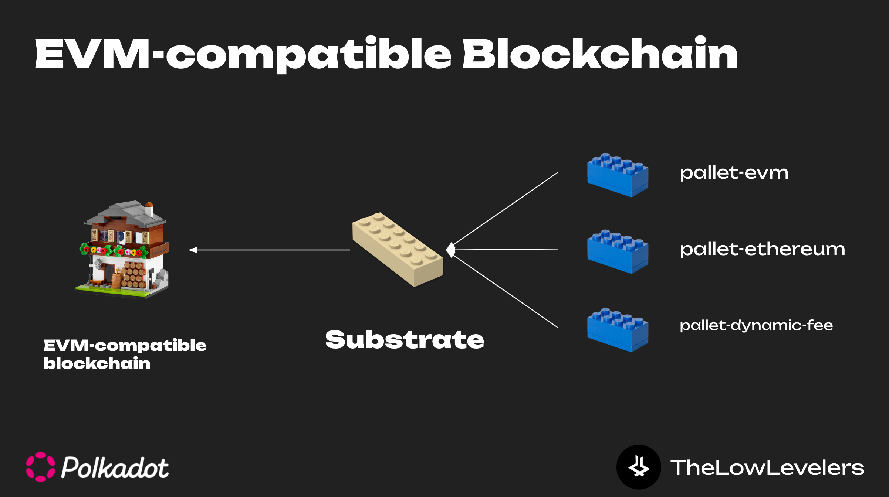
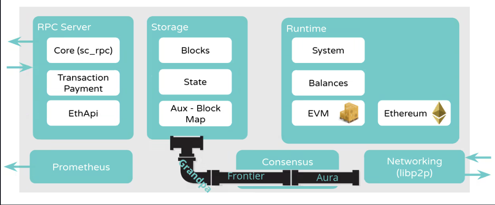
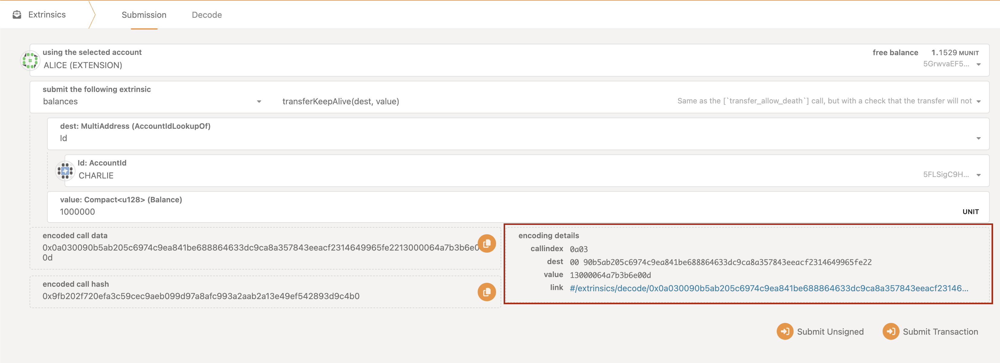
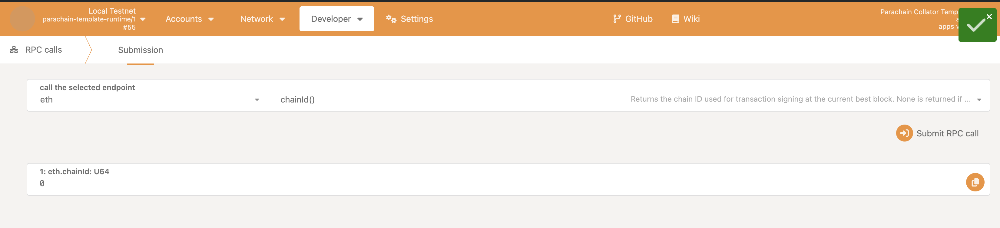
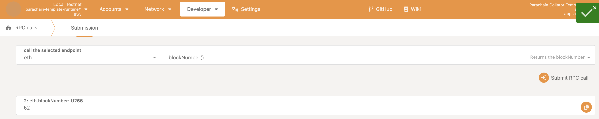
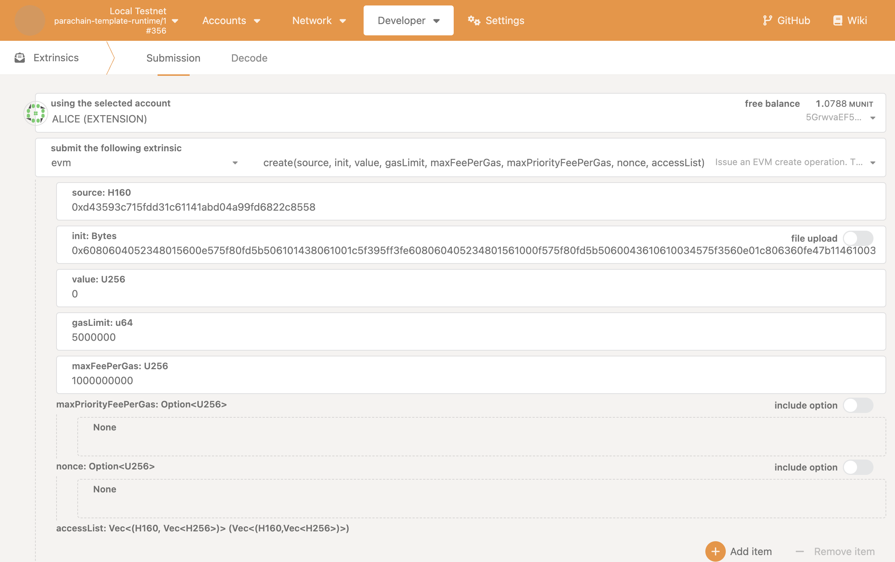
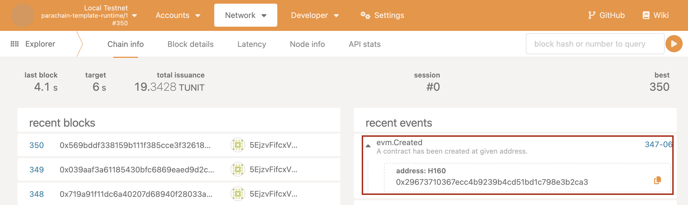
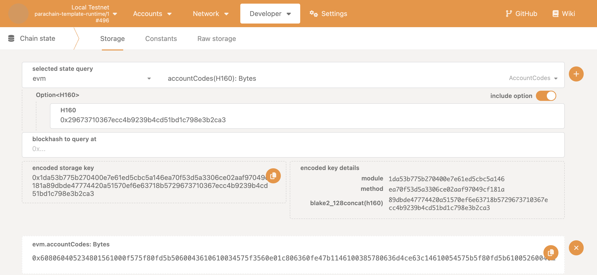
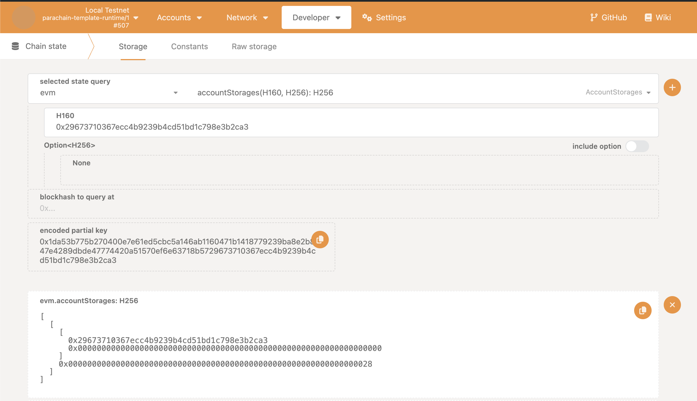

# Giới thiệu Frontier
Frontier là tập hợp các thư viện hỗ trợ tích hợp EVM layer trên Substrate một cách nhanh chóng 

Gồm 2 thành phần chính:
+ `pallet-evm`: Deploy và tương tác EVM contract trực tiếp với runtime 
+ `pallet-ethereum` và `Ethereum compatible RPC methods`: Hỗ trợ Ethereum compatible RPC , nghĩa là có thể dùng Metamask hoặc các development tool cho EVM contract 
như etherjs, web3js, viem, ... 




Link github: https://github.com/polkadot-evm/frontier


## Cách tích hợp Ethereum 




### 1. Add `pallet-evm`, `pallet-ethereum`, `pallet-base-fee` vào runtime và implement Config cho Runtime


<details>
  <summary>Code</summary>
    ```rust
    // runtime/src/lib.rs
    // Create the runtime by composing the FRAME pallets that were previously configured.
    construct_runtime!(
        pub enum Runtime {
            // System support stuff.
            System: frame_system = 0,

            ...
            // Frontier
            Ethereum: pallet_ethereum = 40,
            EVM: pallet_evm = 41,
            EVMChainId: pallet_evm_chain_id = 42,
            BaseFee: pallet_base_fee = 43,
        }
    );
    ```
</details>


### 2. Thêm self contained unchecked extrinsic 

<details>
  <summary>Code</summary>
```rust
// runtime/src/lib.rs

...
/// Unchecked extrinsic type as expected by this runtime.
pub type UncheckedExtrinsic =
    fp_self_contained::UncheckedExtrinsic<Address, RuntimeCall, Signature, SignedExtra>;

/// Extrinsic type that has already been checked.
pub type CheckedExtrinsic =
    fp_self_contained::CheckedExtrinsic<AccountId, RuntimeCall, SignedExtra, H160>;


...
impl fp_self_contained::SelfContainedCall for RuntimeCall {
    type SignedInfo = H160;

    fn is_self_contained(&self) -> bool {
        match self {
            RuntimeCall::Ethereum(call) => call.is_self_contained(),
            _ => false,
        }
    }

    fn check_self_contained(&self) -> Option<Result<Self::SignedInfo, TransactionValidityError>> {
        match self {
            RuntimeCall::Ethereum(call) => call.check_self_contained(),
            _ => None,
        }
    }

    fn validate_self_contained(
        &self,
        info: &Self::SignedInfo,
        dispatch_info: &DispatchInfoOf<RuntimeCall>,
        len: usize,
    ) -> Option<TransactionValidity> {
        match self {
            RuntimeCall::Ethereum(call) => call.validate_self_contained(info, dispatch_info, len),
            _ => None,
        }
    }

    fn pre_dispatch_self_contained(
        &self,
        info: &Self::SignedInfo,
        dispatch_info: &DispatchInfoOf<RuntimeCall>,
        len: usize,
    ) -> Option<Result<(), TransactionValidityError>> {
        match self {
            RuntimeCall::Ethereum(call) => {
                call.pre_dispatch_self_contained(info, dispatch_info, len)
            }
            _ => None,
        }
    }

    fn apply_self_contained(
        self,
        info: Self::SignedInfo,
    ) -> Option<sp_runtime::DispatchResultWithInfo<PostDispatchInfoOf<Self>>> {
        match self {
            call @ RuntimeCall::Ethereum(pallet_ethereum::Call::transact { .. }) => {
                Some(call.dispatch(RuntimeOrigin::from(
                    pallet_ethereum::RawOrigin::EthereumTransaction(info),
                )))
            }
            _ => None,
        }
    }
}

```
</details>


#### UncheckedExtrinsic là gì 
Là format extrinsic (transaction) dưới dạng `bytes` , được encode bởi SCALE Codec từ `Address` , `RuntimeCall`, `Signature`, .. đồng thời kiểm tra một số validation rule như
spec version, , genesis hash , nonce, ... trước khi user thực hiện extrinsic 




<details>
  <summary>Code</summary>
    ```rust
    /// The SignedExtension to the basic transaction logic.
    pub type SignedExtra = (
        frame_system::CheckNonZeroSender<Runtime>,
        frame_system::CheckSpecVersion<Runtime>,
        frame_system::CheckTxVersion<Runtime>,
        frame_system::CheckGenesis<Runtime>,
        frame_system::CheckEra<Runtime>,
        frame_system::CheckNonce<Runtime>,
        frame_system::CheckWeight<Runtime>,
        pallet_transaction_payment::ChargeTransactionPayment<Runtime>,
        cumulus_primitives_storage_weight_reclaim::StorageWeightReclaim<Runtime>,
    );
    ```
</details>


#### CheckedExtrinsic là gì 

`UncheckedExtrinsic` được convert sang `CheckedExtrinsic` trong quá trình đưa transaction vào transaction pool, sau đó đưa vào 1 block
-> Nghĩa là transaction đã được check trước khi đưa vào block 

-> **Verify first, write last**

https://github.com/substrate-developer-hub/substrate-verifiable-credentials/blob/master/docs/securing-issuing.md#verify-first-write-last


Để tìm hiểu kĩ hơn các bạn có thể tham khảo: 
+ https://docs.substrate.io/learn/transaction-types/
+ https://docs.substrate.io/learn/transaction-lifecycle/


### 3. Thêm Ethereum runtime API ( ETH compatible RPC methods)

<details>
  <summary>Code</summary>
```rust

impl_runtime_apis! {
    ...
    impl fp_rpc::EthereumRuntimeRPCApi<Block> for Runtime {
        fn chain_id() -> u64 {
            <Runtime as pallet_evm::Config>::ChainId::get()
        }

        fn account_basic(address: H160) -> EVMAccount {
            let (account, _) = pallet_evm::Pallet::<Runtime>::account_basic(&address);
            account
        }

        fn gas_price() -> U256 {
            let (gas_price, _) = <Runtime as pallet_evm::Config>::FeeCalculator::min_gas_price();
            gas_price
        }

        fn account_code_at(address: H160) -> Vec<u8> {
            pallet_evm::AccountCodes::<Runtime>::get(address)
        }

        fn author() -> H160 {
            <pallet_evm::Pallet<Runtime>>::find_author()
        }

        fn storage_at(address: H160, index: U256) -> H256 {
            let mut tmp = [0u8; 32];
            index.to_big_endian(&mut tmp);
            pallet_evm::AccountStorages::<Runtime>::get(address, H256::from_slice(&tmp[..]))
        }

        fn call(
            from: H160,
            to: H160,
            data: Vec<u8>,
            value: U256,
            gas_limit: U256,
            max_fee_per_gas: Option<U256>,
            max_priority_fee_per_gas: Option<U256>,
            nonce: Option<U256>,
            estimate: bool,
            access_list: Option<Vec<(H160, Vec<H256>)>>,
        ) -> Result<pallet_evm::CallInfo, sp_runtime::DispatchError> {
            let config = if estimate {
                let mut config = <Runtime as pallet_evm::Config>::config().clone();
                config.estimate = true;
                Some(config)
            } else {
                None
            };

            let gas_limit = gas_limit.min(u64::MAX.into());
            let transaction_data = TransactionData::new(
                TransactionAction::Call(to),
                data.clone(),
                nonce.unwrap_or_default(),
                gas_limit,
                None,
                max_fee_per_gas,
                max_priority_fee_per_gas,
                value,
                Some(<Runtime as pallet_evm::Config>::ChainId::get()),
                access_list.clone().unwrap_or_default(),
            );
            let (weight_limit, proof_size_base_cost) = pallet_ethereum::Pallet::<Runtime>::transaction_weight(&transaction_data);

            <Runtime as pallet_evm::Config>::Runner::call(
                from,
                to,
                data,
                value,
                gas_limit.unique_saturated_into(),
                max_fee_per_gas,
                max_priority_fee_per_gas,
                nonce,
                access_list.unwrap_or_default(),
                false,
                true,
                weight_limit,
                proof_size_base_cost,
                config.as_ref().unwrap_or(<Runtime as pallet_evm::Config>::config()),
            ).map_err(|err| err.error.into())
        }

        fn create(
            from: H160,
            data: Vec<u8>,
            value: U256,
            gas_limit: U256,
            max_fee_per_gas: Option<U256>,
            max_priority_fee_per_gas: Option<U256>,
            nonce: Option<U256>,
            estimate: bool,
            access_list: Option<Vec<(H160, Vec<H256>)>>,
        ) -> Result<pallet_evm::CreateInfo, sp_runtime::DispatchError> {
            let config = if estimate {
                let mut config = <Runtime as pallet_evm::Config>::config().clone();
                config.estimate = true;
                Some(config)
            } else {
                None
            };

            let transaction_data = TransactionData::new(
                TransactionAction::Create,
                data.clone(),
                nonce.unwrap_or_default(),
                gas_limit,
                None,
                max_fee_per_gas,
                max_priority_fee_per_gas,
                value,
                Some(<Runtime as pallet_evm::Config>::ChainId::get()),
                access_list.clone().unwrap_or_default(),
            );
            let (weight_limit, proof_size_base_cost) = pallet_ethereum::Pallet::<Runtime>::transaction_weight(&transaction_data);

            <Runtime as pallet_evm::Config>::Runner::create(
                from,
                data,
                value,
                gas_limit.unique_saturated_into(),
                max_fee_per_gas,
                max_priority_fee_per_gas,
                nonce,
                access_list.unwrap_or_default(),
                false,
                true,
                weight_limit,
                proof_size_base_cost,
                config.as_ref().unwrap_or(<Runtime as pallet_evm::Config>::config()),
            ).map_err(|err| err.error.into())
        }

        fn current_transaction_statuses() -> Option<Vec<TransactionStatus>> {
            pallet_ethereum::CurrentTransactionStatuses::<Runtime>::get()
        }

        fn current_block() -> Option<pallet_ethereum::Block> {
            pallet_ethereum::CurrentBlock::<Runtime>::get()
        }

        fn current_receipts() -> Option<Vec<pallet_ethereum::Receipt>> {
            pallet_ethereum::CurrentReceipts::<Runtime>::get()
        }

        fn current_all() -> (
            Option<pallet_ethereum::Block>,
            Option<Vec<pallet_ethereum::Receipt>>,
            Option<Vec<TransactionStatus>>
        ) {
            (
                pallet_ethereum::CurrentBlock::<Runtime>::get(),
                pallet_ethereum::CurrentReceipts::<Runtime>::get(),
                pallet_ethereum::CurrentTransactionStatuses::<Runtime>::get()
            )
        }

        fn extrinsic_filter(
            xts: Vec<<Block as BlockT>::Extrinsic>,
        ) -> Vec<EthereumTransaction> {
            xts.into_iter().filter_map(|xt| match xt.0.function {
                RuntimeCall::Ethereum(transact { transaction }) => Some(transaction),
                _ => None
            }).collect::<Vec<EthereumTransaction>>()
        }

        fn elasticity() -> Option<Permill> {
            Some(pallet_base_fee::Elasticity::<Runtime>::get())
        }

        fn gas_limit_multiplier_support() {}

        fn pending_block(
            xts: Vec<<Block as BlockT>::Extrinsic>,
        ) -> (Option<pallet_ethereum::Block>, Option<Vec<TransactionStatus>>) {
            for ext in xts.into_iter() {
                let _ = Executive::apply_extrinsic(ext);
            }

            Ethereum::on_finalize(System::block_number() + 1);

            (
                pallet_ethereum::CurrentBlock::<Runtime>::get(),
                pallet_ethereum::CurrentTransactionStatuses::<Runtime>::get()
            )
        }
    }
}
```
</details>


### 4. Implement TransactionConverter

<details>
  <summary>Code</summary>
```rust
pub struct TransactionConverter;

impl fp_rpc::ConvertTransaction<UncheckedExtrinsic> for TransactionConverter {
	fn convert_transaction(&self, transaction: pallet_ethereum::Transaction) -> UncheckedExtrinsic {
		UncheckedExtrinsic::new_unsigned(
			pallet_ethereum::Call::<Runtime>::transact { transaction }.into(),
		)
	}
}

impl fp_rpc::ConvertTransaction<opaque::UncheckedExtrinsic> for TransactionConverter {
	fn convert_transaction(
		&self,
		transaction: pallet_ethereum::Transaction,
	) -> opaque::UncheckedExtrinsic {
		let extrinsic = UncheckedExtrinsic::new_unsigned(
			pallet_ethereum::Call::<Runtime>::transact { transaction }.into(),
		);
		let encoded = extrinsic.encode();
		opaque::UncheckedExtrinsic::decode(&mut &encoded[..])
			.expect("Encoded extrinsic is always valid")
	}
}
```
</details>


### 5. Thêm convert transaction ETH  sang Substrate Runtime API 

<details>
  <summary>Code</summary>
```rust
impl_runtime_apis! {
    ...
    impl fp_rpc::ConvertTransactionRuntimeApi<Block> for Runtime {
        fn convert_transaction(transaction: EthereumTransaction) -> <Block as BlockT>::Extrinsic {
            UncheckedExtrinsic::new_unsigned(
                pallet_ethereum::Call::<Runtime>::transact { transaction }.into(),
            )
        }
    }
}
``` 
</details>


### 6. Định nghĩa Eth RPC and mapping sync worker ở node 
<details>
  <summary>Code</summary>
```rust
pub type FrontierBackend = fc_db::Backend<Block>;

pub fn db_config_dir(config: &Configuration) -> PathBuf {
    config.base_path.config_dir(config.chain_spec.id())
}

/// Avalailable frontier backend types.
#[derive(Debug, Copy, Clone, Default, clap::ValueEnum)]
pub enum BackendType {
    /// Either RocksDb or ParityDb as per inherited from the global backend settings.
    #[default]
    KeyValue,
    /// Sql database with custom log indexing.
    Sql,
}

/// The ethereum-compatibility configuration used to run a node.
#[derive(Clone, Debug, clap::Parser)]
pub struct EthConfiguration {
    /// Maximum number of logs in a query.
    #[arg(long, default_value = "10000")]
    pub max_past_logs: u32,

    /// Maximum fee history cache size.
    #[arg(long, default_value = "2048")]
    pub fee_history_limit: u64,

    #[arg(long)]
    pub enable_dev_signer: bool,

    /// The dynamic-fee pallet target gas price set by block author
    #[arg(long, default_value = "1")]
    pub target_gas_price: u64,

    /// Maximum allowed gas limit will be `block.gas_limit * execute_gas_limit_multiplier`
    /// when using eth_call/eth_estimateGas.
    #[arg(long, default_value = "10")]
    pub execute_gas_limit_multiplier: u64,

    /// Size in bytes of the LRU cache for block data.
    #[arg(long, default_value = "50")]
    pub eth_log_block_cache: usize,

    /// Size in bytes of the LRU cache for transactions statuses data.
    #[arg(long, default_value = "50")]
    pub eth_statuses_cache: usize,

    /// Sets the frontier backend type (KeyValue or Sql)
    #[arg(long, value_enum, ignore_case = true, default_value_t = BackendType::default())]
    pub frontier_backend_type: BackendType,

    // Sets the SQL backend's pool size.
    #[arg(long, default_value = "100")]
    pub frontier_sql_backend_pool_size: u32,

    /// Sets the SQL backend's query timeout in number of VM ops.
    #[arg(long, default_value = "10000000")]
    pub frontier_sql_backend_num_ops_timeout: u32,

    /// Sets the SQL backend's auxiliary thread limit.
    #[arg(long, default_value = "4")]
    pub frontier_sql_backend_thread_count: u32,

    /// Sets the SQL backend's query timeout in number of VM ops.
    /// Default value is 200MB.
    #[arg(long, default_value = "209715200")]
    pub frontier_sql_backend_cache_size: u64,
}

pub struct FrontierPartialComponents {
    pub filter_pool: Option<FilterPool>,
    pub fee_history_cache: FeeHistoryCache,
    pub fee_history_cache_limit: FeeHistoryCacheLimit,
}

pub fn new_frontier_partial(
    config: &EthConfiguration,
) -> Result<FrontierPartialComponents, ServiceError> {
    Ok(FrontierPartialComponents {
        filter_pool: Some(Arc::new(Mutex::new(BTreeMap::new()))),
        fee_history_cache: Arc::new(Mutex::new(BTreeMap::new())),
        fee_history_cache_limit: config.fee_history_limit,
    })
}

/// A set of APIs that ethereum-compatible runtimes must implement.
pub trait EthCompatRuntimeApiCollection:
    sp_api::ApiExt<Block>
    + fp_rpc::EthereumRuntimeRPCApi<Block>
    + fp_rpc::ConvertTransactionRuntimeApi<Block>
{
}

impl<Api> EthCompatRuntimeApiCollection for Api where
    Api: sp_api::ApiExt<Block>
        + fp_rpc::EthereumRuntimeRPCApi<Block>
        + fp_rpc::ConvertTransactionRuntimeApi<Block>
{
}

#[allow(clippy::too_many_arguments)]
pub async fn spawn_frontier_tasks<RuntimeApi, Executor>(
    task_manager: &TaskManager,
    client: Arc<TFullClient<Block, RuntimeApi, NativeElseWasmExecutor<Executor>>>,
    backend: Arc<TFullBackend<Block>>,
    frontier_backend: FrontierBackend,
    filter_pool: Option<FilterPool>,
    overrides: Arc<OverrideHandle<Block>>,
    fee_history_cache: FeeHistoryCache,
    fee_history_cache_limit: FeeHistoryCacheLimit,
    sync: Arc<SyncingService<Block>>,
    pubsub_notification_sinks: Arc<
        fc_mapping_sync::EthereumBlockNotificationSinks<
            fc_mapping_sync::EthereumBlockNotification<Block>,
        >,
    >,
) where
    RuntimeApi: ConstructRuntimeApi<
        Block,
        TFullClient<Block, RuntimeApi, NativeElseWasmExecutor<Executor>>,
    >,
    RuntimeApi: Send + Sync + 'static,
    RuntimeApi::RuntimeApi: EthCompatRuntimeApiCollection,
    Executor: NativeExecutionDispatch + 'static,
{
    // Spawn main mapping sync worker background task.

    match frontier_backend {
        fc_db::Backend::KeyValue(b) => {
            task_manager.spawn_essential_handle().spawn(
                "frontier-mapping-sync-worker",
                Some("frontier"),
                MappingSyncWorker::new(
                    client.import_notification_stream(),
                    Duration::new(6, 0),
                    client.clone(),
                    backend,
                    overrides.clone(),
                    Arc::new(b),
                    3,
                    0,
                    SyncStrategy::Parachain,
                    sync,
                    pubsub_notification_sinks,
                )
                .for_each(|()| future::ready(())),
            );
        }
        fc_db::Backend::Sql(b) => {
            task_manager.spawn_essential_handle().spawn_blocking(
                "frontier-mapping-sync-worker",
                Some("frontier"),
                fc_mapping_sync::sql::SyncWorker::run(
                    client.clone(),
                    backend,
                    Arc::new(b),
                    client.import_notification_stream(),
                    fc_mapping_sync::sql::SyncWorkerConfig {
                        read_notification_timeout: Duration::from_secs(10),
                        check_indexed_blocks_interval: Duration::from_secs(60),
                    },
                    fc_mapping_sync::SyncStrategy::Parachain,
                    sync,
                    pubsub_notification_sinks,
                ),
            );
        }
    }

    // Spawn Frontier EthFilterApi maintenance task.
    if let Some(filter_pool) = filter_pool {
        // Each filter is allowed to stay in the pool for 100 blocks.
        const FILTER_RETAIN_THRESHOLD: u64 = 100;
        task_manager.spawn_essential_handle().spawn(
            "frontier-filter-pool",
            Some("frontier"),
            EthTask::filter_pool_task(client.clone(), filter_pool, FILTER_RETAIN_THRESHOLD),
        );
    }

    // Spawn Frontier FeeHistory cache maintenance task.
    task_manager.spawn_essential_handle().spawn(
        "frontier-fee-history",
        Some("frontier"),
        EthTask::fee_history_task(
            client,
            overrides,
            fee_history_cache,
            fee_history_cache_limit,
        ),
    );
}
```
</details>


### 7. Add eth rpc vào service 

<details>
  <summary>Code</summary>
  ```rust
    // Sinks for pubsub notifications.
    // Everytime a new subscription is created, a new mpsc channel is added to the sink pool.
    // The MappingSyncWorker sends through the channel on block import and the subscription emits a notification to the subscriber on receiving a message through this channel.
    // This way we avoid race conditions when using native substrate block import notification stream.
    let pubsub_notification_sinks: fc_mapping_sync::EthereumBlockNotificationSinks<
        fc_mapping_sync::EthereumBlockNotification<Block>,
    > = Default::default();
    let pubsub_notification_sinks = Arc::new(pubsub_notification_sinks);
    let slot_duration = cumulus_client_consensus_aura::slot_duration(&*client)?;
    let target_gas_price = eth_config.target_gas_price;

    // for ethereum-compatibility rpc.
    parachain_config.rpc_id_provider = Some(Box::new(fc_rpc::EthereumSubIdProvider));
    let eth_rpc_params = crate::rpc::EthDeps {
        client: client.clone(),
        pool: transaction_pool.clone(),
        graph: transaction_pool.pool().clone(),
        converter: Some(TransactionConverter),
        is_authority: parachain_config.role.is_authority(),
        enable_dev_signer: eth_config.enable_dev_signer,
        network: network.clone(),
        sync: sync_service.clone(),
        frontier_backend: match frontier_backend.clone() {
            fc_db::Backend::KeyValue(b) => Arc::new(b),
            fc_db::Backend::Sql(b) => Arc::new(b),
        },
        overrides: overrides.clone(),
        block_data_cache: Arc::new(fc_rpc::EthBlockDataCacheTask::new(
            task_manager.spawn_handle(),
            overrides.clone(),
            eth_config.eth_log_block_cache,
            eth_config.eth_statuses_cache,
            prometheus_registry.clone(),
        )),
        filter_pool: filter_pool.clone(),
        max_past_logs: eth_config.max_past_logs,
        fee_history_cache: fee_history_cache.clone(),
        fee_history_cache_limit,
        execute_gas_limit_multiplier: eth_config.execute_gas_limit_multiplier,
        forced_parent_hashes: None,
        pending_create_inherent_data_providers: move |_, ()| async move {
            let current = sp_timestamp::InherentDataProvider::from_system_time();
            let next_slot = current.timestamp().as_millis() + slot_duration.as_millis();
            let timestamp = sp_timestamp::InherentDataProvider::new(next_slot.into());
            let slot = sp_consensus_aura::inherents::InherentDataProvider::from_timestamp_and_slot_duration(
				*timestamp,
				slot_duration,
			);
            let dynamic_fee = fp_dynamic_fee::InherentDataProvider(U256::from(target_gas_price));
            Ok((slot, timestamp, dynamic_fee))
        },
    };

    let rpc_builder = {
        let client = client.clone();
        let transaction_pool = transaction_pool.clone();
        let pubsub_notification_sinks = pubsub_notification_sinks.clone();

        Box::new(move |deny_unsafe, subscription_task_executor| {
            let deps = crate::rpc::FullDeps {
                client: client.clone(),
                pool: transaction_pool.clone(),
                deny_unsafe,
                eth: eth_rpc_params.clone(),
            };

            crate::rpc::create_full(
                deps,
                subscription_task_executor,
                pubsub_notification_sinks.clone(),
            )
            .map_err(Into::into)
        })
    };
  ```
</details>


### 8. Spawn frontier task

<details>
  <summary>Code</summary>
  ```rust
      #[allow(clippy::let_underscore_future)]
    let _ = spawn_frontier_tasks(
        &task_manager,
        client.clone(),
        backend.clone(),
        frontier_backend,
        filter_pool,
        overrides,
        fee_history_cache,
        fee_history_cache_limit,
        sync_service.clone(),
        pubsub_notification_sinks,
    )
    .await;
  ```
</details>


## Account 

Frontier hỗ trợ 2 cách convert Substrate Address(H256) sang `H160` 

### Mapping giữa H160 sang H256

<details>
  <summary>Code</summary>
```rust
/// frontier/frame/evm/src/lib.rs

/// Trait to be implemented for evm address mapping.
pub trait AddressMapping<A> {
	fn into_account_id(address: H160) -> A;
}

/// Identity address mapping.
pub struct IdentityAddressMapping;

impl<T: From<H160>> AddressMapping<T> for IdentityAddressMapping {
	fn into_account_id(address: H160) -> T {
		address.into()
	}
}

/// Hashed address mapping.
pub struct HashedAddressMapping<H>(core::marker::PhantomData<H>);

impl<H: Hasher<Out = H256>> AddressMapping<AccountId32> for HashedAddressMapping<H> {
	fn into_account_id(address: H160) -> AccountId32 {
		let mut data = [0u8; 24];
		data[0..4].copy_from_slice(b"evm:");
		data[4..24].copy_from_slice(&address[..]);
		let hash = H::hash(&data);

		AccountId32::from(Into::<[u8; 32]>::into(hash))
	}
}

```
</details>


### Unified Address 
+ Sử dụng Native H160 
+ Moonbeam

## Call eth rpc 

**Lưu ý: Phải chạy parachain evm template** [Cách chạy](../install_and_run_substrate_node/interact_substrate_node.mdx)

### Lấy chain id 



### Lấy blocknumber hiện tại 



## Tương tác pallet-evm deploy và tương tác evm smart contract 

### Định nghĩa chain id và pre-funds cho evm accounts ở genesis block


+ Chain id và pre-funds evm-account
<details>
  <summary>node/src/chain_spec.rs</summary>
```rust
// Định nghĩa chain id và evm accounts
// node/src/chain_spec.rs
fn testnet_genesis(
    invulnerables: Vec<(AccountId, AuraId)>,
    endowed_accounts: Vec<AccountId>,
    root: AccountId,
    id: ParaId,
) -> serde_json::Value {
    let mut map = BTreeMap::new();
    map.insert(
        // Mapping H160 with Alice's Substrate PublicKey
        H160::from_str("d43593c715fdd31c61141abd04a99fd6822c8558")
            .expect("internal H160 is valid; qed"),
        GenesisAccount {
            balance: U256::from_str("0xfffffffffffffffffffff")
                .expect("internal U256 is valid; qed"),
            code: Default::default(),
            nonce: Default::default(),
            storage: Default::default(),
        },
    );
    serde_json::json!({
        "balances": {
            "balances": endowed_accounts.iter().cloned().map(|k| (k, 1u64 << 60)).collect::<Vec<_>>(),
        },
        ...
        "evm": {
            "accounts": map
        },
        "evmChainId":{
            "chainId":2024
        }
    })
}

```
</details>

### Compile contract 
+ Storage Contract
<details>
  <summary>Storage Contract</summary>
```javascript
// SPDX-License-Identifier: MIT
pragma solidity ^0.8.0;

contract Storage {
    uint256 private data;

    // Store a value
    function set(uint256 _data) public {
        data = _data;
    }

    // Retrieve the stored value
    function get() public view returns (uint256) {
        return data;
    }
}

```
</details>


+ Có thể sử dụng Remix hoặc `solc` , ... 

<details>
  <summary>Bytecode của Storage Contract</summary>
  ```javascript
0x6080604052348015600e575f80fd5b506101438061001c5f395ff3fe608060405234801561000f575f80fd5b5060043610610034575f3560e01c806360fe47b1146100385780636d4ce63c14610054575b5f80fd5b610052600480360381019061004d91906100ba565b610072565b005b61005c61007b565b60405161006991906100f4565b60405180910390f35b805f8190555050565b5f8054905090565b5f80fd5b5f819050919050565b61009981610087565b81146100a3575f80fd5b50565b5f813590506100b481610090565b92915050565b5f602082840312156100cf576100ce610083565b5b5f6100dc848285016100a6565b91505092915050565b6100ee81610087565b82525050565b5f6020820190506101075f8301846100e5565b9291505056fea2646970667358221220f5e748529aefb7612ff3047e62db9086cce1c62076d2eca0379ed178726be7c864736f6c634300081a0033
```
</details>


### Deploy evm contract

Polkadot Explorer -> Developer -> Extrinsics -> evm -> create 

| Param | Giá trị |
| --- | --- |
| source | 0xd43593c715fdd31c61141abd04a99fd6822c8558  |
| init | raw bytecode hex value  |
| value | 0  |
| gasLimit | 5000000   |
| maxFeePerGas | 1000000000   |




### Lấy contract Address



### Kiểm tra Storage Code



### Tương tác contract 
Polkadot Explorer -> Developer -> Extrinsics -> evm -> call 

Lấy input encoded data từ https://abi.hashex.org/ bằng cách import abi json 

Ví dụ Input: `set(40)`

-> `60fe47b10000000000000000000000000000000000000000000000000000000000000028`


| Param | Giá trị |
| --- | --- |
| source | 0xd43593c715fdd31c61141abd04a99fd6822c8558  |
| target | contract address vừa tạo  |
| input | 0x60fe47b10000000000000000000000000000000000000000000000000000000000000028  |
| value | 0  |
| gasLimit | 5000000   |
| maxFeePerGas | 1000000000   |


### Kiểm tra Onchain Storage





## Tài liệu tham khảo 

+ https://docs.substrate.io/tutorials/integrate-with-tools/evm-integration/
+ https://docs.substrate.io/tutorials/integrate-with-tools/access-evm-accounts/


