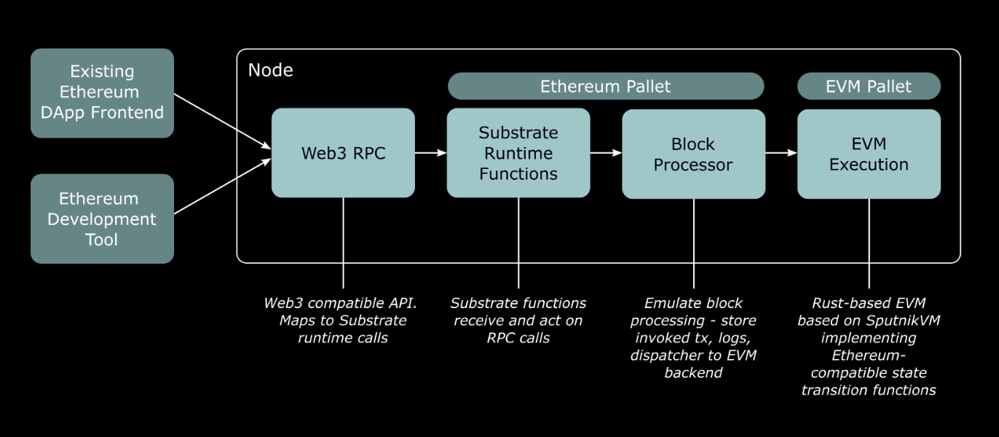

# Giới thiệu Moonbeam 

## Moonbeam là gì?

+ Là một nền tảng hợp đồng thông minh tương thích với Ethereum được xây dựng trên Polkadot. 
+ Cho phép các nhà phát triển triển khai các ứng dụng phi tập trung (DApps) dựa trên Ethereum hiện có với ít thay đổi, cung cấp  quá trình chuyển đổi dễ dàng từ Ethereum sang hệ sinh thái Polkadot. 
+ Moonbeam mở rộng bộ tính năng cơ bản của Ethereum với các khả năng bổ sung như quản trị trên chuỗi, staking, và tích hợp chuỗi chéo

## Các đặc trưng của Moonbeam

### Tương thích với Ethereum
Moonbeam hỗ trợ Ethereum Virtual Machine (EVM), Web3 API, và các công cụ Ethereum hiện có như MetaMask, Remix, Hardhat,..., giúp các nhà phát triển dễ dàng chuyển ứng dụng của họ sang nền tảng này.
### Tích hợp chuỗi chéo

+ Moonbeam cho phép tính năng chuỗi chéo với các parachain khác và các mạng bên ngoài, cho phép tài sản và dữ liệu di chuyển giữa các blockchain khác nhau.

+ https://apps.moonbeam.network/moonbeam/mrl
+ https://apps.moonbeam.network/moonbeam/xcm

### Quản trị trên chuỗi (Onchain Governance)

+ Moonbeam giới thiệu mô hình quản trị trên chuỗi linh hoạt, cho phép cộng đồng ảnh hưởng đến sự phát triển của mạng lưới.

+ https://apps.moonbeam.network/moonbeam/open-gov

### Tài khoản hợp nhất (Unified Account)
Người dùng có thể sử dụng một địa chỉ H160 duy nhất cho cả tài sản dựa trên Ethereum và Substrate, đơn giản hóa trải nghiệm người dùng

## Cấu trúc Moonbeam

Tóm tắt 

1. Web3 RPC Call từ một ứng dụng phi tập trung (DApp) hoặc công cụ phát triển Ethereum hiện có, chẳng hạn như Hardhat, được nhận bởi một node Moonbeam. 
2. Node này có Web3 RPC và Substrate RPC, có nghĩa là bạn có thể sử dụng các công cụ Ethereum hoặc Substrate khi tương tác với một node Moonbeam. 
3. Các RPC Call này được xử lý bởi runtime API Substrate. 
4. Substrate runtime kiểm tra chữ ký và xử lý các transaction từ evm. 
5. Các tương tác smart contract cuối cùng được chuyển đến EVM để thực hiện các chuyển đổi trạng thái (state transition)

## Moonbeam Ecosystem

https://apps.moonbeam.network/moonbeam/app-dir

## Tài liệu tham khảo
+ https://docs.moonbeam.network/learn/platform/technology/
+ https://docs.moonbeam.network/learn/platform/why-polkadot/
