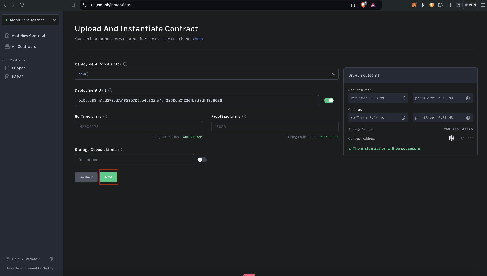
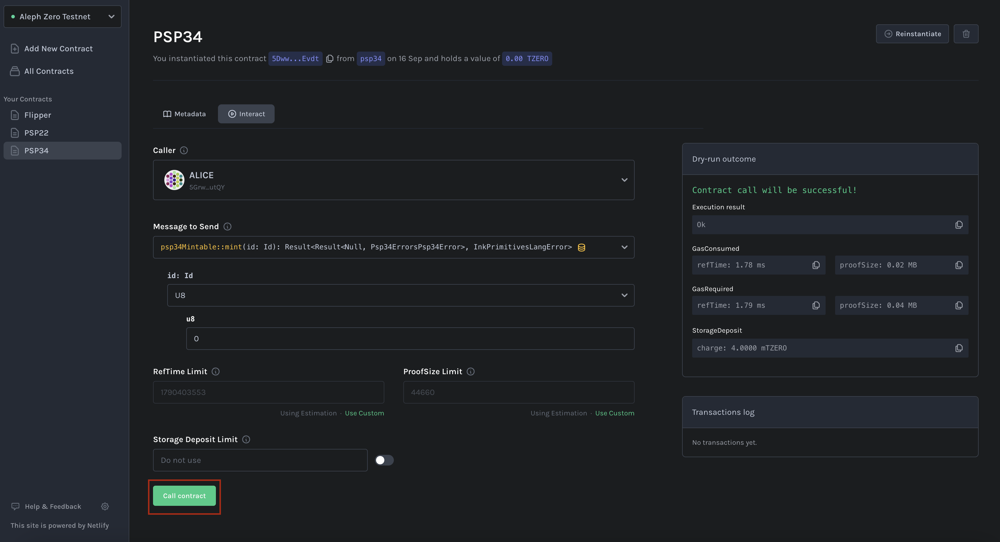

# Phân tích code chuẩn psp34 ink! 


## Tạo psp34 contract bằng POP CLI

```bash
pop new contract my_psp34 -c psp -t PSP34
```


## Build psp34 

```bash
cargo contract build --release --features "contract"
```


## Phân tích code 


## Cách import nft psp34 trên mạng Aleph Zero Testnet - Subwallet

Noted: Yêu cầu cài Subwallet Extension
[Cài đặt SubWallet Extension](../ink_advance/token_extension_psp22#cài-đặt-subwallet-extension-trên-google-chromfirefoxbrave)


### Deploy contract trên mạng Aleph Zero Testnet bằng Contract UI 

Bước deploy sẽ tương tự như các bước mình có hướng dẫn ở section [Ink Basic - Contract Template](../../ink_basic/contract_template#sử-dụng-contract-ui-deploy-trên-pop-network-testnet)
Nên mình bỏ qua bước này 




### Mint PSP34 NFT trên mạng Aleph Zero Testnet bằng Contract UI 





### Import collections trên mạng Aleph Zero Testnet - Subwallet

https://docs.subwallet.app/main/extension-user-guide/import-and-manage-customized-assets/import-nfts


## Tài liệu tham khảo 
+ https://docs.subwallet.app/main/extension-user-guide/import-and-manage-customized-assets/import-nfts

