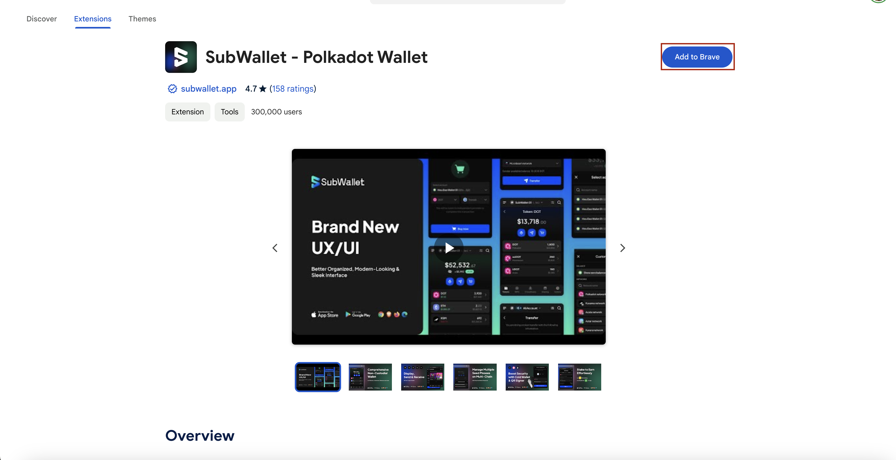
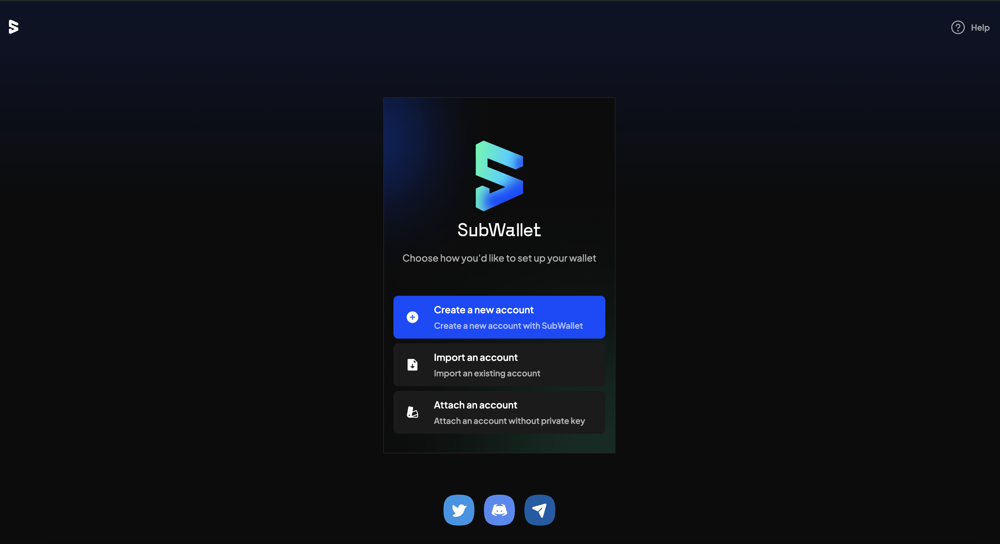
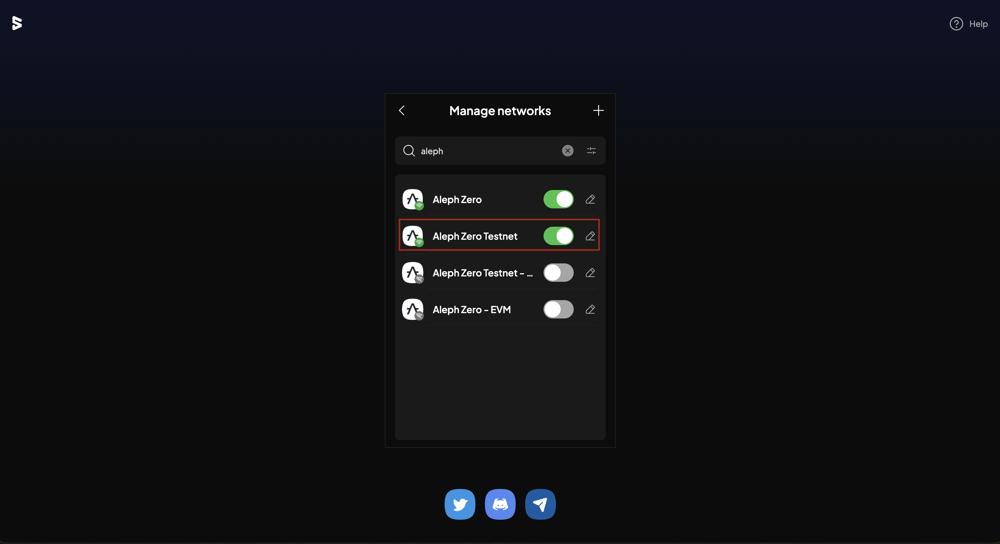
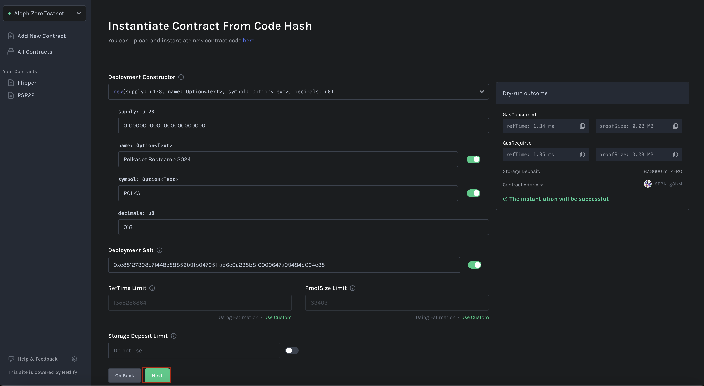
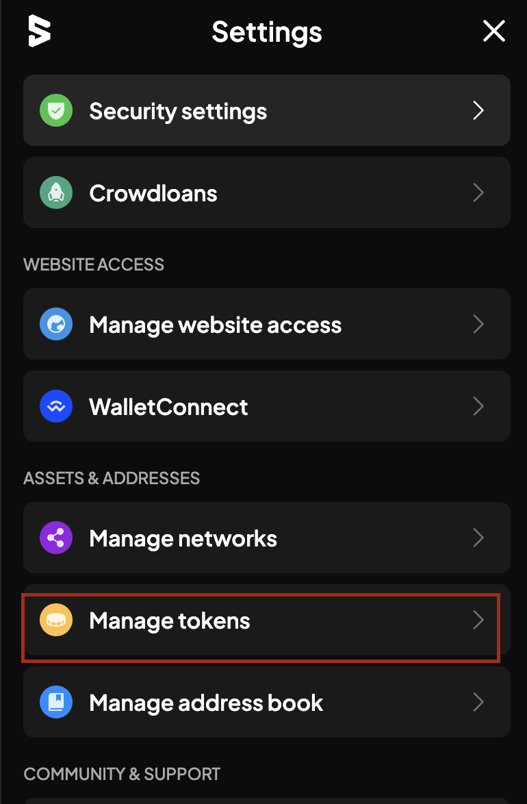
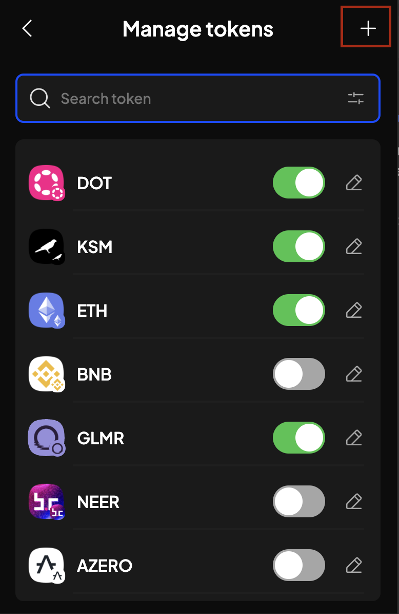
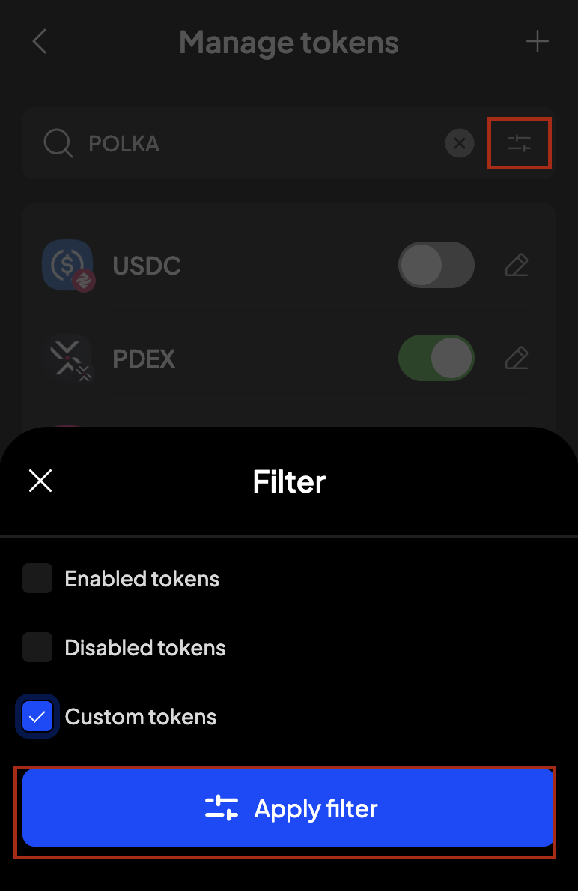

# Phân tích code chuẩn psp22 ink! 


## Tạo psp22 contract bằng POP CLI

```bash
pop new contract my_psp22 -c psp -t PSP22
```


## Phân tích code 

### Cấu trúc code 
```rust
├── Cargo.lock
├── Cargo.toml
├── LICENSE
├── README.md
├── data.rs // Implement helper function, định nghĩa data cho contract 
├── errors.rs // Định nghĩa lỗi 
├── events.rs // Định nghĩa events
├── lib.rs // nơi định nghĩa on-chain storage 
├── testing.rs // viết test case 
└── traits.rs // định nghĩa share behaviours -> phục vụ cho việc cross contract 
```


<details>
  <summary>lib.rs</summary>

```rust
#![cfg_attr(not(feature = "std"), no_std, no_main)]

mod data;
mod errors;
mod events;
mod testing;
mod traits;

pub use data::{PSP22Data, PSP22Event};
pub use errors::PSP22Error;
pub use events::{Approval, Transfer};
pub use traits::{PSP22Burnable, PSP22Metadata, PSP22Mintable, PSP22};

#[ink::contract]
mod token {
    use crate::{PSP22Data, PSP22Error, PSP22Event, PSP22Metadata, PSP22};
    use ink::prelude::{string::String, vec::Vec};

    // Định nghĩa on-chain storage 
    // Thêm PSP22Data định nghĩa ở data.rs 
    #[ink(storage)]
    pub struct Token {
        data: PSP22Data,
        name: Option<String>,
        symbol: Option<String>,
        decimals: u8,
    }

    impl Token {

        // Khởi tạo contract với total supply, name, symbol và token decimals 
        #[ink(constructor)]
        pub fn new(
            supply: u128,
            name: Option<String>,
            symbol: Option<String>,
            decimals: u8,
        ) -> Self {
            let (data, events) = PSP22Data::new(supply, Self::env().caller()); // (2)
            let contract = Self {
                data,
                name,
                symbol,
                decimals,
            };
            contract.emit_events(events);
            contract
        }

        // Helper function để emit event -> import event từ events.rs
        fn emit_events(&self, events: Vec<PSP22Event>) {
            for event in events {
                match event {
                    PSP22Event::Transfer(e) => self.env().emit_event(e),
                    PSP22Event::Approval(e) => self.env().emit_event(e),
                }
            }
        }
    }

    // Implement trait PSP22 (traits.rs) cho contract token 
    impl PSP22 for Token {

        // Lấy tổng cung hiện tại 
        #[ink(message)]
        fn total_supply(&self) -> u128 {
            self.data.total_supply()
        }


        // Lấy balance của 1 account 
        #[ink(message)]
        fn balance_of(&self, owner: AccountId) -> u128 {
            self.data.balance_of(owner)
        }

        // Số lượng token mà owner cho phép spender (bên thứ 3) sử dụng 

        #[ink(message)]
        fn allowance(&self, owner: AccountId, spender: AccountId) -> u128 {
            self.data.allowance(owner, spender)
        }

        // Transfer token của caller sang 1 account khác  
        #[ink(message)]
        fn transfer(
            &mut self,
            to: AccountId,
            value: u128,
            _data: Vec<u8>,
        ) -> Result<(), PSP22Error> {
            // Helper function
            let events = self.data.transfer(self.env().caller(), to, value)?;
            self.emit_events(events);
            Ok(())
        }

        // Chức năng `transferFrom` thường được sử dụng khi một tài khoản (owner) đã cấp quyền cho 
        // một tài khoản khác (thường là một hợp đồng thông minh gọi là spender ) để sử dụng token thay mặt cho tài khoản owner đó .

        #[ink(message)]
        fn transfer_from(
            &mut self,
            from: AccountId,
            to: AccountId,
            value: u128,
            _data: Vec<u8>,
        ) -> Result<(), PSP22Error> {
            let events = self
                .data
                .transfer_from(self.env().caller(), from, to, value)?;
            self.emit_events(events);
            Ok(())
        }

        // Cho phép spender sử dụng một lượng token nhất định mà owner cho phép 
        #[ink(message)]
        fn approve(&mut self, spender: AccountId, value: u128) -> Result<(), PSP22Error> {
            let events = self.data.approve(self.env().caller(), spender, value)?;
            self.emit_events(events);
            Ok(())
        }


        // Tăng lượng token cho phép mà spender có thể sử dụng 
        #[ink(message)]
        fn increase_allowance(
            &mut self,
            spender: AccountId,
            delta_value: u128,
        ) -> Result<(), PSP22Error> {
            let events = self
                .data
                .increase_allowance(self.env().caller(), spender, delta_value)?;
            self.emit_events(events);
            Ok(())
        }

        // Giảm lượng token cho phép mà spender có thể sử dụng 

        #[ink(message)]
        fn decrease_allowance(
            &mut self,
            spender: AccountId,
            delta_value: u128,
        ) -> Result<(), PSP22Error> {
            let events = self
                .data
                .decrease_allowance(self.env().caller(), spender, delta_value)?;
            self.emit_events(events);
            Ok(())
        }
    }

    // Implement trait metadata cho token 
    // Gồm có return token name , token symbol, token decimals 

    impl PSP22Metadata for Token {
        #[ink(message)]
        fn token_name(&self) -> Option<String> {
            self.name.clone()
        }
        #[ink(message)]
        fn token_symbol(&self) -> Option<String> {
            self.symbol.clone()
        }
        #[ink(message)]
        fn token_decimals(&self) -> u8 {
            self.decimals
        }
    }
}

```
</details>


<details>
  <summary>data.rs</summary>

```rust
use crate::errors::PSP22Error;
use crate::events::{Approval, Transfer};
use ink::prelude::string::String;
use ink::{
    prelude::{vec, vec::Vec},
    primitives::AccountId,
    storage::Mapping,
};

// Định nghĩa Events cho Transfer và Approval 
pub enum PSP22Event {
    Transfer(Transfer),
    Approval(Approval),
}


fn approval_event(owner: AccountId, spender: AccountId, amount: u128) -> PSP22Event {
    PSP22Event::Approval(Approval {
        owner,
        spender,
        amount,
    })
}

fn transfer_event(from: Option<AccountId>, to: Option<AccountId>, value: u128) -> PSP22Event {
    PSP22Event::Transfer(Transfer { from, to, value })
}


// Định nghĩa storage item -> on-chain storage 
#[ink::storage_item]
#[derive(Debug, Default)]
pub struct PSP22Data {
    total_supply: u128,
    balances: Mapping<AccountId, u128>,
    allowances: Mapping<(AccountId, AccountId), u128>,
}

// Helper function phục vụ cho implement READ/WRITE method 
impl PSP22Data {
    pub fn new(supply: u128, creator: AccountId) -> (PSP22Data, Vec<PSP22Event>) {
        let mut data: PSP22Data = Default::default();
        let events = data.mint(creator, supply).unwrap();
        (data, events)
    }


    pub fn total_supply(&self) -> u128 {
        self.total_supply
    }

    pub fn balance_of(&self, owner: AccountId) -> u128 {
        self.balances.get(owner).unwrap_or_default()
    }

    pub fn allowance(&self, owner: AccountId, spender: AccountId) -> u128 {
        self.allowances.get((owner, spender)).unwrap_or_default()
    }


    pub fn transfer(
        &mut self,
        caller: AccountId,
        to: AccountId,
        value: u128,
    ) -> Result<Vec<PSP22Event>, PSP22Error> {
        if caller == to || value == 0 {
            return Ok(vec![]);
        }
        let from_balance = self.balance_of(caller);
        if from_balance < value {
            return Err(PSP22Error::InsufficientBalance);
        }

        if from_balance == value {
            self.balances.remove(caller);
        } else {
            self.balances
                .insert(caller, &(from_balance.saturating_sub(value)));
        }
        let to_balance = self.balance_of(to);
        // Total supply is limited by u128.MAX so no overflow is possible
        self.balances
            .insert(to, &(to_balance.saturating_add(value)));
        Ok(vec![transfer_event(Some(caller), Some(to), value)])
    }

    pub fn transfer_from(
        &mut self,
        caller: AccountId,
        from: AccountId,
        to: AccountId,
        value: u128,
    ) -> Result<Vec<PSP22Event>, PSP22Error> {
        if from == to || value == 0 {
            return Ok(vec![]);
        }
        if caller == from {
            return self.transfer(caller, to, value);
        }

        let allowance = self.allowance(from, caller);
        if allowance < value {
            return Err(PSP22Error::InsufficientAllowance);
        }
        let from_balance = self.balance_of(from);
        if from_balance < value {
            return Err(PSP22Error::InsufficientBalance);
        }

        if allowance == value {
            self.allowances.remove((from, caller));
        } else {
            self.allowances
                .insert((from, caller), &(allowance.saturating_sub(value)));
        }

        if from_balance == value {
            self.balances.remove(from);
        } else {
            self.balances
                .insert(from, &(from_balance.saturating_sub(value)));
        }
        let to_balance = self.balance_of(to);
        // Total supply is limited by u128.MAX so no overflow is possible
        self.balances
            .insert(to, &(to_balance.saturating_add(value)));
        Ok(vec![
            approval_event(from, caller, allowance.saturating_sub(value)),
            transfer_event(Some(from), Some(to), value),
        ])
    }

    pub fn approve(
        &mut self,
        owner: AccountId,
        spender: AccountId,
        value: u128,
    ) -> Result<Vec<PSP22Event>, PSP22Error> {
        if owner == spender {
            return Ok(vec![]);
        }
        if value == 0 {
            self.allowances.remove((owner, spender));
        } else {
            self.allowances.insert((owner, spender), &value);
        }
        Ok(vec![approval_event(owner, spender, value)])
    }

    pub fn increase_allowance(
        &mut self,
        owner: AccountId,
        spender: AccountId,
        delta_value: u128,
    ) -> Result<Vec<PSP22Event>, PSP22Error> {
        if owner == spender || delta_value == 0 {
            return Ok(vec![]);
        }
        let allowance = self.allowance(owner, spender);
        let amount = allowance.saturating_add(delta_value);
        self.allowances.insert((owner, spender), &amount);
        Ok(vec![approval_event(owner, spender, amount)])
    }

    pub fn decrease_allowance(
        &mut self,
        owner: AccountId,
        spender: AccountId,
        delta_value: u128,
    ) -> Result<Vec<PSP22Event>, PSP22Error> {
        if owner == spender || delta_value == 0 {
            return Ok(vec![]);
        }
        let allowance = self.allowance(owner, spender);
        if allowance < delta_value {
            return Err(PSP22Error::InsufficientAllowance);
        }
        let amount = allowance.saturating_sub(delta_value);
        if amount == 0 {
            self.allowances.remove((owner, spender));
        } else {
            self.allowances.insert((owner, spender), &amount);
        }
        Ok(vec![approval_event(owner, spender, amount)])
    }

    pub fn mint(&mut self, to: AccountId, value: u128) -> Result<Vec<PSP22Event>, PSP22Error> {
        if value == 0 {
            return Ok(vec![]);
        }
        let new_supply = self
            .total_supply
            .checked_add(value)
            .ok_or(PSP22Error::Custom(String::from(
                "Max PSP22 supply exceeded. Max supply limited to 2^128-1.",
            )))?;
        self.total_supply = new_supply;
        let new_balance = self.balance_of(to).saturating_add(value);
        self.balances.insert(to, &new_balance);
        Ok(vec![transfer_event(None, Some(to), value)])
    }

    pub fn burn(&mut self, from: AccountId, value: u128) -> Result<Vec<PSP22Event>, PSP22Error> {
        if value == 0 {
            return Ok(vec![]);
        }
        let balance = self.balance_of(from);
        if balance < value {
            return Err(PSP22Error::InsufficientBalance);
        }
        if balance == value {
            self.balances.remove(from);
        } else {
            self.balances.insert(from, &(balance.saturating_sub(value)));
        }
        self.total_supply = self.total_supply.saturating_sub(value);
        Ok(vec![transfer_event(Some(from), None, value)])
    }
}


```
</details>


## Cách import token psp22 trên mạng Aleph Zero Testnet - Subwallet

### Cài đặt Subwallet Extension trên Google Chrom/Firefox/Brave

Link cài đặt: https://chromewebstore.google.com/detail/subwallet-polkadot-wallet/onhogfjeacnfoofkfgppdlbmlmnplgbn?hl=en



### Tạo địa chỉ ví mới hoặc import wallet 



### Chọn Manage Networks -> Choose Aleph Zero Testnet




### Faucet nếu account của bạn chưa có native tokens

Faucet Aleph Zero: https://faucet.test.azero.dev/


### Deploy contract trên mạng Aleph Zero Testnet bằng Contract UI 

Bước deploy sẽ tương tự như các bước mình có hướng dẫn ở section [Ink Basic - Contract Template](../../ink_basic/contract_template#sử-dụng-contract-ui-deploy-trên-pop-network-testnet)
Nên mình bỏ qua bước này 

Ví dụ: 

| Param | Giá trị |
| --- | --- |
| supply | 10000000000000000000000  |
| name | Polkadot Bootcamp   |
| symbol | POLKAD  |
| decimals | 18  |



### Import token trên mạng Aleph Zero Testnet - Subwallet

#### Step 1: Vào Subwallet -> Settings -> Manage Tokens 




#### Step 2: Click nút `+` 
Add custom token 



#### Step 3: Import token

Ví dụ:
| Param | Giá trị |
| --- | --- |
| Select Network | Aleph Zero Testnet  |
| Select Token Type | PSP22   |
| Contract Address | 5CtoPHQqxj4HgYkKoqP7vFn5Ap7E2acL1TxCJvcyh3Qt6sLT  |


#### Show custom token 
Filter token 




## Tài liệu tham khảo:
+ https://docs.subwallet.app/main/mobile-app-user-guide/import-and-manage-customized-assets/import-tokens-and-manage-customized-tokens


