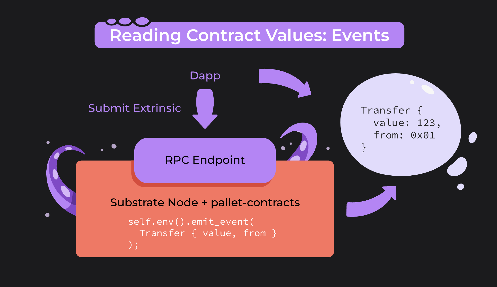

# Cấu trúc cơ bản của ink! smart contract


## Định nghĩa ink! contract 
+ Sử dụng `#[ink::contract]` 

```rust
    #[ink::contract]
    mod <tên module> {
        ...
    }
```

## Cách định nghĩa on-chain storage 
+ Sử dụng `#[ink::storage]` 


```rust
    #[ink(storage)]
    pub struct <tên contract> {
        // Các trường dữ liệu on-chain
    }
```

### Ví dụ 1 : Hỗ trợ hầu hết các kiễu dữ liệu nguyên thuỷ Rust

```rust
#[ink(storage)]
pub struct MyContract {
    // Store a bool
    my_bool: bool,
    // Store some number
    my_number: u32,
    // Store some String
    my_string: String,
    // Store some u32 in a vec
    my_vector: Vec<u32>,
}
/* --snip-- */
```

### Ví dụ 2: Substrate Types như AccountId, Hash, Balance

```rust
#[ink(storage)]
pub struct MyContract {
    // Store some AccountId
    my_account: AccountId,
    // Store some Balance
    my_balance: Balance,
    // Store some Hash
    my_hash: Hash,
}
/* --snip-- */
```

### Ví dụ 3: Mapping 

```rust
#[ink(storage)]
#[derive(Default)]
pub struct Mappings {
    /// Mapping from owner to number of owned token.
    balances: Mapping<AccountId, Balance>,
    /// Mapping from owner to aliases.
    names: Mapping<AccountId, Vec<String>>,
}
```


### Ví dụ 4: Enum và Struct

Lưu ý import 2 thư viện này ở `Cargo.toml` 
```rust
[dependencies]
...
scale-info = { version = "2.6", default-features = false, features = ["derive"]}
scale = { package = "parity-scale-codec", version = "3", default-features = false, features = ["derive"] }
```

+ Định nghĩa Enum 
```rust
#[derive(scale::Encode, scale::Decode, Debug)]
#[cfg_attr(feature = "std", derive(StorageLayout, scale_info::TypeInfo))]
pub enum Status {
    /// An auction has not started yet.
    NotStarted,
    /// We are in the starting period of the auction, collecting initial bids.
    OpeningPeriod,
}
```


```rust
mod MyContract {
    use ink::prelude::string::String;
    use ink::prelude::vec::Vec;

    // Định nghĩa struct lưu thông tin Status 
    #[derive(scale::Encode, scale::Decode, Debug)]
    #[cfg_attr(feature = "std", derive(StorageLayout, scale_info::TypeInfo))]
    pub struct Auction {
        /// Branded name of the auction event.
        name: String,
        /// Some hash identifying the auction subject.
        subject: Hash,
        /// Auction status.
        status: Status, // Enum: Usage shown in next section
        /// Candle auction can have no winner.
        /// If auction is finalized, that means that the winner is determined.
        finalized: bool,
        /// vector
        vector: Vec<u8>,
    }

    #[ink(storage)]
    pub struct MyContract {
        // Store Auctions in a vec
        auctions: Vec<Auction>,
    }
}

```

## Hàm WRITE (&mut self) 

+ Cấu trúc:
```rust
fn <tên hàm> (&mut self, ...) {
    ... 
    }
```


+ Ví dụ 
```rust
impl MyContract {

    #[ink(message)]
    pub fn my_setter(&mut self, new_value: u32) {
        self.my_number = new_value;
    }
}
```

## Hàm READ (&self) 

+ Cấu trúc:
```rust
fn <tên hàm> (&self, ...) {
    ... 
    }
```


+ Ví dụ

```rust
impl MyContract {

    #[ink(message)]
    pub fn my_setter(&mut self, new_value: u32) {
        self.my_number = new_value;
    }
}
```


## Events




+ Định nghĩa event

```rust
#[ink(event)]
pub struct Released {
    value: Balance,
    to: AccountId,
}
```

+ Emit event

```rust
#[ink(message)]
pub fn release(&mut self) -> Result<(), Error> {
    ...

    self.env().emit_event(Released {
        value: releasable,
        to: self.beneficiary,
    });

    Ok(())
}
```

## Errors

+ Định nghĩa Errors 

```rust
#[derive(Debug, PartialEq, Eq)]
#[ink::scale_derive(Encode, Decode, TypeInfo)]
pub enum Error {
    InvalidBeneficiary,
    ZeroReleasableBalance,
}
```

+ Return errors 

```rust
#[ink(message)]
pub fn release(&mut self) -> Result<(), Error> {
    let releasable = self.releasable_balance();
    if releasable == 0 {
        return Err(Error::ZeroReleasableBalance)
    }
    ...
    Ok(())
}
```


## Gas trong ink!
Gas là tài nguyên sử dụng khi thực hiện tương tác với smart contract 
Bao gồm:
+ không gian lưu trữ proof (for storing data in the contract's storage) 
+ thời gian tính toán (for executing the contract and its logic)

-> Trong Substrate: `Gas = (refTime, proofSize)`

-> Gas -> người thực hiện sẽ trả 1 lượng phí (phí lưu trữ) 

### refTime

Lượng thời gian tính toán có thể được sử dụng cho việc thực thi, tính bằng picogiây

### proofSize 

+ proofSize is the size of the proof that individual parachains send to the Polkadot or Kusama relay chain to allow re-executing their block for validation (this is called Proof of Validity). 
+ Phrased differently: Layer-1 chains send a proof of validity to a Layer-0 chain to validate the block. This Proof of Validity contains everything necessary to execute the block -- the code of each contract that is executed plus the storage each contract reads and writes


