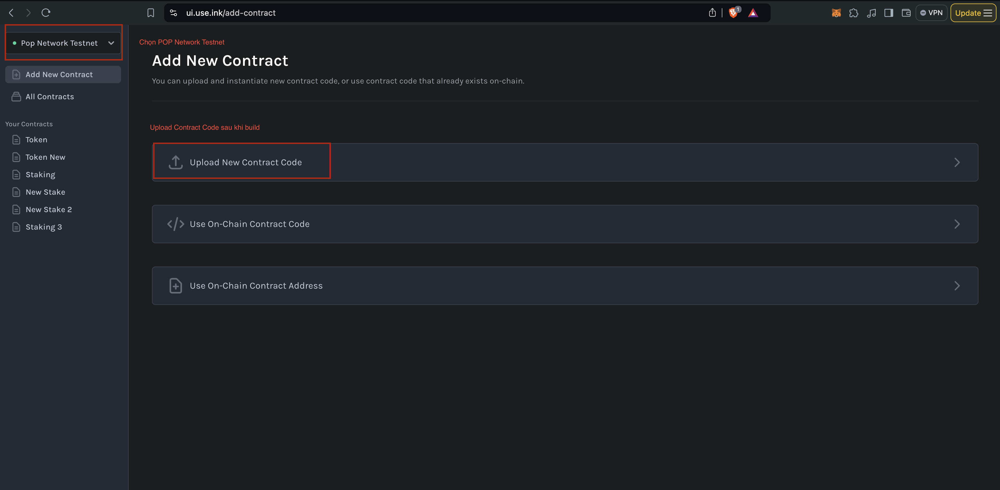
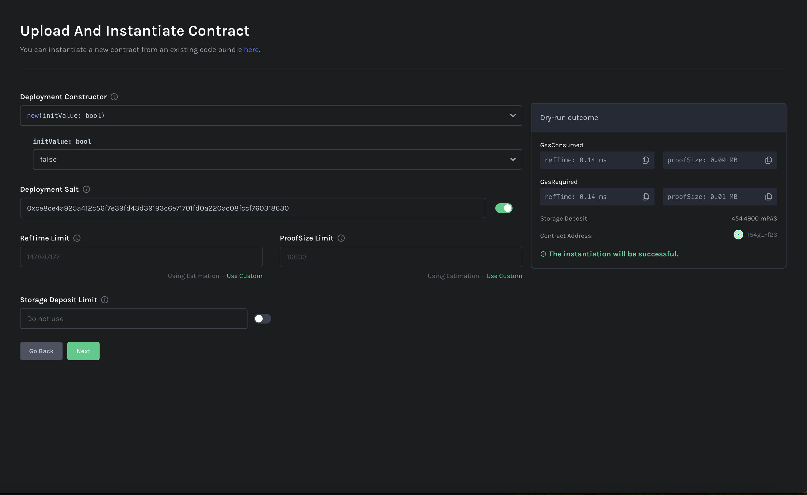
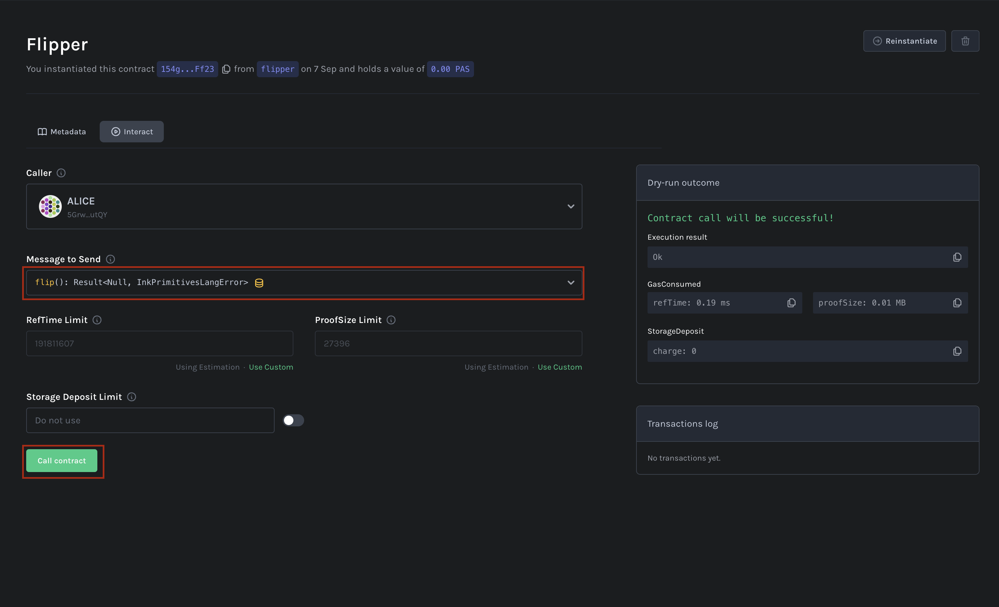
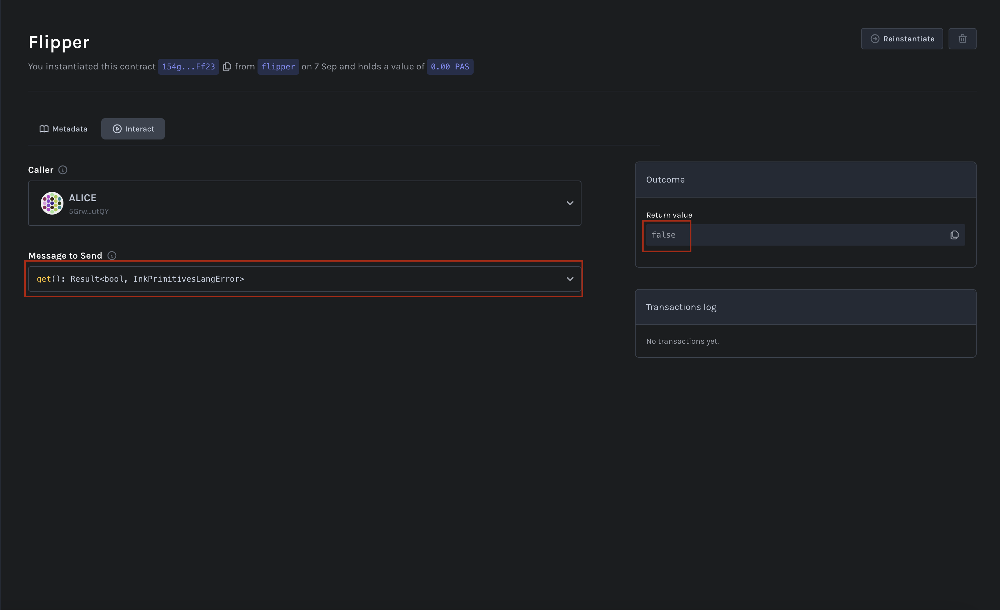

# Contract Template 

## Tạo dự án ink! Flipper 

Sử dụng pop cli 

```bash
pop new contract flipper
```

Sau khi tạo contract xong:
```
flipper
  └─ lib.rs                <-- Contract Source Code
  └─ Cargo.toml            <-- Rust Dependencies and ink! Configuration
  └─ .gitignore
```

## Phân tích code cơ bản 

### Cargo.toml

<details>
  <summary>Code</summary>
    ```rust
    [package]
    name = "flipper"
    version = "0.1.0"
    authors = ["[your_name] <[your_email]>"]
    edition = "2021"
    // import thư viện ink 
    [dependencies]
    ink = { version = "5.0.0", default-features = false }

    // Hỗ trợ e2e testing 
    [dev-dependencies]
    ink_e2e = { version = "5.0.0" }
    // Thay vì chạy file main.rs thì chạy file lib.rs
    [lib]
    path = "lib.rs"
    // Tương tự như pallet 
    [features]
    default = ["std"]
    std = [
        "ink/std",
    ]
    ink-as-dependency = []
    e2e-tests = []
    ```
</details>


### lib.rs
Gồm 3 chức năng chính 

1. Định nghĩa hàm khởi tạo khi deploy contract (hỗ trợ multiple constructor)

Sử dụng hàm `new` 
```rust
    #[ink(constructor)]
    pub fn new(init_value: bool) -> Self {
        Self { value: init_value }
    }
```

Sử dụng hàm `default` 
```rust
    #[ink(constructor)]
    pub fn default() -> Self {
        Self::new(Default::default())
    }
```

1. Chuyển đổi trạng thái `true` sang `false` và ngược lại 

```rust
    #[ink(message)]
    pub fn flip(&mut self) {
        self.value = !self.value;
    }
```
2. Lấy thông tin trạng thái hiện tại 

```rust
    #[ink(message)]
    pub fn get(&self) -> bool {
        self.value
    }
```

## Tương tự code Rust 

```rust
pub struct Flipper {
    value: bool
}

impl Flipper {
    pub fn init(init_value: bool) -> Self {
        Self { value: init_value }
    }

    pub fn default() -> Self {
        Self::init(Default::default())
    }

    pub fn flip(&mut self) {
        self.value = !self.value;
    }

    pub fn get(&self) -> bool {
        self.value
    }
}
```

## Chạy unit test


```rust
    #[cfg(test)]
    mod tests {
        /// Imports all the definitions from the outer scope so we can use them here.
        use super::*;

        /// We test if the default constructor does its job.
        #[ink::test]
        fn default_works() {
            let flipper = Flipper::default();
            assert_eq!(flipper.get(), false);
        }

        /// We test a simple use case of our contract.
        #[ink::test]
        fn it_works() {
            let mut flipper = Flipper::new(false);
            assert_eq!(flipper.get(), false);
            flipper.flip();
            assert_eq!(flipper.get(), true);
        }
    }
```

Sử dụng command để chạy test:

```bash
pop test contract 
```


## Chạy e2e test

```bash
cargo test --features e2e-tests
```

## Tương tác contract 

### RPC endpoint 
POP NETWORK TESTNET: `wss://rpc1.paseo.popnetwork.xyz`

ALEPH ZERO TESTNET: `wss://ws.test.azero.dev`

### Faucet 
Faucet Polkadot Testnet: https://faucet.polkadot.io/

Faucet POP Network Testnet: https://onboard.popnetwork.xyz/

Faucet Aleph Zero: https://faucet.test.azero.dev/


### Build contract

```bash
pop build 
```

Kết quả sau khi build:

```rust
│  
│    - flipper.contract (code + metadata)
│    - flipper.wasm (the contract's code)
│    - flipper.json (the contract's metadata)
```

### Sử dụng ink! CLI (Aleph Zero Testnet) 

#### Step 1: Deploy the contract (Instantiate) 

```bash
cargo contract instantiate --constructor new --args true -s "//Alice" --url wss://ws.test.azero.dev -x
```

<details>
  <summary>Kết quả </summary>
```rust
 Dry-running new (skip with --skip-dry-run)
    Success! Gas required estimated at Weight(ref_time: 147322009, proof_size: 16689)
Confirm transaction details: (skip with --skip-confirm or -y)
 Constructor new
        Args true
   Gas limit Weight(ref_time: 147322009, proof_size: 16689)
Submit? (Y/n): y
      Events
       Event Balances ➜ Withdraw
         who: 5GrwvaEF5zXb26Fz9rcQpDWS57CtERHpNehXCPcNoHGKutQY
         amount: 334.800097μTZERO
       Event Contracts ➜ CodeStored
         code_hash: 0xc9a3371d9272feba4faa0045a08bc6adc8b61c4a68d279a595ccd150aaa9bea9
         deposit_held: 426.04mTZERO
         uploader: 5GrwvaEF5zXb26Fz9rcQpDWS57CtERHpNehXCPcNoHGKutQY
       Event System ➜ NewAccount
         account: 5FVK4afyN6p6NSfzEzvcCx9KsDgAfc95RSDHT4TJP7wj6NpV
       Event Balances ➜ Endowed
         account: 5FVK4afyN6p6NSfzEzvcCx9KsDgAfc95RSDHT4TJP7wj6NpV
         free_balance: 0.50nTZERO
       Event Balances ➜ Transfer
         from: 5GrwvaEF5zXb26Fz9rcQpDWS57CtERHpNehXCPcNoHGKutQY
         to: 5FVK4afyN6p6NSfzEzvcCx9KsDgAfc95RSDHT4TJP7wj6NpV
         amount: 0.50nTZERO
       Event Contracts ➜ Instantiated
         deployer: 5GrwvaEF5zXb26Fz9rcQpDWS57CtERHpNehXCPcNoHGKutQY
         contract: 5FVK4afyN6p6NSfzEzvcCx9KsDgAfc95RSDHT4TJP7wj6NpV
       Event Contracts ➜ StorageDepositTransferredAndHeld
         from: 5GrwvaEF5zXb26Fz9rcQpDWS57CtERHpNehXCPcNoHGKutQY
         to: 5FVK4afyN6p6NSfzEzvcCx9KsDgAfc95RSDHT4TJP7wj6NpV
         amount: 133.972mTZERO
       Event Contracts ➜ StorageDepositTransferredAndHeld
         from: 5GrwvaEF5zXb26Fz9rcQpDWS57CtERHpNehXCPcNoHGKutQY
         to: 5FVK4afyN6p6NSfzEzvcCx9KsDgAfc95RSDHT4TJP7wj6NpV
         amount: 1.32mTZERO
       Event Balances ➜ Deposit
         who: 5GrwvaEF5zXb26Fz9rcQpDWS57CtERHpNehXCPcNoHGKutQY
         amount: 824.914nTZERO
       Event Balances ➜ Deposit
         who: 5EYCAe5fg5WiYGVNH6QpCFnu55Hzv9MwtjFHdQCx8EaSQTm2
         amount: 333.975183μTZERO
       Event Treasury ➜ Deposit
         value: 333975183
       Event TransactionPayment ➜ TransactionFeePaid
         who: 5GrwvaEF5zXb26Fz9rcQpDWS57CtERHpNehXCPcNoHGKutQY
         actual_fee: 333.975183μTZERO
         tip: 0TZERO
       Event System ➜ ExtrinsicSuccess
         dispatch_info: DispatchInfo { weight: Weight { ref_time: 3339741184, proof_size: 9097 }, class: Normal, pays_fee: Yes }

   Code hash 0xc9a3371d9272feba4faa0045a08bc6adc8b61c4a68d279a595ccd150aaa9bea9
    Contract 5FVK4afyN6p6NSfzEzvcCx9KsDgAfc95RSDHT4TJP7wj6NpV
```
</details>


```bash
Code hash 0xc9a3371d9272feba4faa0045a08bc6adc8b61c4a68d279a595ccd150aaa9bea9
Contract 5FVK4afyN6p6NSfzEzvcCx9KsDgAfc95RSDHT4TJP7wj6NpV
```

#### Step 2: Get value 

```bash
cargo contract call --contract 5FVK4afyN6p6NSfzEzvcCx9KsDgAfc95RSDHT4TJP7wj6NpV --message get --suri "//Alice" --url wss://ws.test.azero.dev
```

Kết quả:
```rust
      Result Ok(true)
    Reverted false
Your message call has not been executed.
```

#### Step 3: Flip message

```bash
cargo contract call --contract 5FVK4afyN6p6NSfzEzvcCx9KsDgAfc95RSDHT4TJP7wj6NpV --message flip --suri "//Alice" --url wss://ws.test.azero.dev -x
```

### Sử dụng POP CLI (Aleph Zero Testnet) 
#### Step 1: Deploy the contract

```bash
pop up contract --constructor new --args false --suri //Alice --url wss://ws.test.azero.dev
```

Kết quả:
```rust
┌   Pop CLI : Deploy a smart contract
│
◇  Gas limit estimate: Weight { ref_time: 147322009, proof_size: 16689 }
│
◇  Contract deployed and instantiated: The Contract Address is "5FKuCodrM86MRLuNLhgjRXGFpZ5h9UFuTgtm1a97pwm5qdyo"
│
└  🚀 Deployment complete
```

#### Step 2: Get value 

```bash
pop call contract --contract 5FKuCodrM86MRLuNLhgjRXGFpZ5h9UFuTgtm1a97pwm5qdyo --message get --url wss://ws.test.azero.dev --dry-run
```

Kết quả:
```rust
┌   Pop CLI : Calling a contract
│
◒  Doing a dry run to estimate the gas...                                                                 ⚙  Gas limit: Weight { ref_time: 471840652, proof_size: 27219 }
│  
▲  Your call has not been executed.
```

#### Step 3: Flip message

```bash
pop call contract --contract 5FKuCodrM86MRLuNLhgjRXGFpZ5h9UFuTgtm1a97pwm5qdyo --message flip --url wss://ws.test.azero.dev -x
```

<details>
  <summary>Kết quả </summary>
```rust
│
◓  Doing a dry run to estimate the gas...                                                                 ⚙  Gas limit: Weight { ref_time: 600499779, proof_size: 27513 }
│  
◐  Calling the contract...                                                                                ⚙        Events
│         Event Balances ➜ Withdraw
│           who: 5GrwvaEF5zXb26Fz9rcQpDWS57CtERHpNehXCPcNoHGKutQY
│           amount: 153.815292μTZERO
│         Event Contracts ➜ Called
│           caller: Signed(5GrwvaEF5zXb26Fz9rcQpDWS57CtERHpNehXCPcNoHGKutQY)
│           contract: 5FKuCodrM86MRLuNLhgjRXGFpZ5h9UFuTgtm1a97pwm5qdyo
│         Event Balances ➜ Deposit
│           who: 5GrwvaEF5zXb26Fz9rcQpDWS57CtERHpNehXCPcNoHGKutQY
│           amount: 859.218nTZERO
│         Event Balances ➜ Deposit
│           who: 5EYCAe5fg5WiYGVNH6QpCFnu55Hzv9MwtjFHdQCx8EaSQTm2
│           amount: 152.956074μTZERO
│         Event Treasury ➜ Deposit
│           value: 152956074
│         Event TransactionPayment ➜ TransactionFeePaid
│           who: 5GrwvaEF5zXb26Fz9rcQpDWS57CtERHpNehXCPcNoHGKutQY
│           actual_fee: 152.956074μTZERO
│           tip: 0TZERO
│         Event System ➜ ExtrinsicSuccess
│           dispatch_info: DispatchInfo { weight: Weight { ref_time: 1529560592, proof_size: 17941 }, class: Normal, pays_fee: Yes }
│  
└  Call completed successfully!
```
</details>


### Sử dụng Contract UI deploy trên POP Network testnet 

Link tương tác contract UI: https://ui.use.ink/

#### Step 1: Upload contract 




#### Step 2: Upload Code 
+ Chọn `Account` muốn deploy contract ( deployer)
+ Tên contract
+ Import file `.contract` sau khi đã build ( `./target/ink`)


#### Step 3: Instantiate the contract (deploy contract) 





#### Step 4: Tương tác hàm `flip` 




#### Step 5: Tương tác hàm `get`

