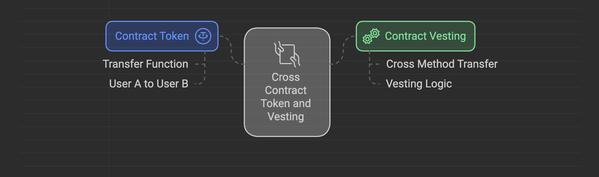

# Cross contract 
Cho phép tương tác các `message READ` và `message WRITE` giữa các contract khác nhau 


## Cách sử dụng

+ Mỗi contract có các chức năng riêng biệt, đôi khi có sự tương tác liên quan giữa các contract với nhau 

Ví dụ:




## Các bước để cross contract cơ bản 

### Step 1: Tạo workspace project sẽ gồm nhiều contracts khác nhau 

Trong ví dụ này, mình đã set up trước `Flipper` contract trong workspace và script để build contract 

Link tham khảo: https://github.com/CocDap/cross-contract-ink-example/tree/01-create-workspace


### Step 2: Thêm `OtherFlipper` contract vào workspace 

Link tham khảo: https://github.com/CocDap/cross-contract-ink-example/tree/02-create-other-flipper/flipper


### Step 3: Import `OtherFlipper` vào `Flipper` Cargo.toml

```rust
// flipper/Cargo.toml

[dependencies]
...
# Note: We **need** to specify the `ink-as-dependency` feature.
#
# If we don't we will end up with linking errors!
other_flipper = { path = "../other_flipper", default-features = false, features = ["ink-as-dependency"] }


... 
[features]
default = ["std"]
std = [
    "ink/std",
    # Note: The metadata generation step requires `std`. If we don't specify this the metadata
    # generation for our contract will fail!
    "other_flipper/std",
]
```

### Step 4: Định nghĩa cross contract trong Flipper contract 

```rust
#[ink(storage)]
pub struct Flipper {
    other_flipper: OtherFlipperRef
}
```

Sau đó định nghĩa constructor:

```rust
#[ink(constructor)]
pub fn new_v1(other_flipper_code_hash: Hash) -> Self {
    let other_flipper = OtherFlipperRef::new(true) // call hàm new của OtherFlipper với giá trị true
        .instantiate_v1()// sử dụng instantiate version 1 
        .code_hash(other_flipper_code_hash) // Code Hash của Other Flipper sau khi deploy - thông tin on-chain
        .endowment(0) // Giá trị native token 
        .salt_bytes([0xDE, 0xAD, 0xBE, 0xEF]) // Đảm bảo tạo ra unique contract address khi contract không thay đổi logic , storage
        .instantiate(); // THực hiện deploy 

    Self { other_flipper }
}
```

### Step 5: Call cross hàm get và flip từ OtherFlipper 

```rust
#[ink(message)]
pub fn cross_flip(&mut self){
    // định nghĩa call builder 
    let call_builder = self.other_flipper.call_mut();

    // call hàm flip
    call_builder.flip().call_v1().invoke();
}

#[ink(message)]
pub fn cross_get(&self) -> bool{
    // định nghĩa call builder 
    let call_builder = self.other_flipper.call();

    // call hàm get 
    call_builder.get().call_v1().invoke()
}
```

## Trait - Shared Behaviour 
+ Sử dụng `#[ink::trait_definition]`
+ Định nghĩa interface cho phép chia sẻ thuộc tính giữa các contract 
+ Truy cập state của các contract 

### Step 1: Định nghĩa trait OtherFlip và implement trait 

+ Định nghĩa trait `OtherFlip` 

```rust
#[ink::trait_definition]
pub trait OtherFlip {
    // định nghĩa abstract method flip 
    #[ink(message)]
    fn flip(&mut self);

    // định nghĩa abstract method get 
    #[ink(message)]
    fn get(&self) -> bool;
}
```


+ Implement Trait `OtherFlip` cho `OtherFlipper` 
```rust
impl OtherFlip for OtherFlipper {
    #[ink(message)]
    fn flip(&mut self) {
        self.value = !self.value;
    }

    #[ink(message)]
    fn get(&self) -> bool {
        self.value
    }
}
```

Link tham khảo: https://github.com/CocDap/cross-contract-ink-example/tree/06-trait-definition

### Step 2: Cross contract trait trong contract Flipper 

```rust
... 
/// import trait 
use other_flipper::OtherFlip;

...

#[ink(storage)]
pub struct Flipper {
    other_flipper: ink::contract_ref!(OtherFlip),
}

... 

#[ink(constructor)]
pub fn new_v1(other_flipper_contract: AccountId) -> Self {


    Self { other_flipper: other_flipper_contract.into() }
}

```


Link tham khảo: https://github.com/CocDap/cross-contract-ink-example/tree/07-cross-trait-definition


### Step 3: Định nghĩa hàm flip và get trait 

```rust

#[ink(message)]
pub fn cross_flip(&mut self){
    self.other_flipper.flip();
}

#[ink(message)]
pub fn cross_get(&self) -> bool{
    self.other_flipper.get()
}

```

Link tham khảo: https://github.com/CocDap/cross-contract-ink-example/tree/08-get-flip-cross-trait


