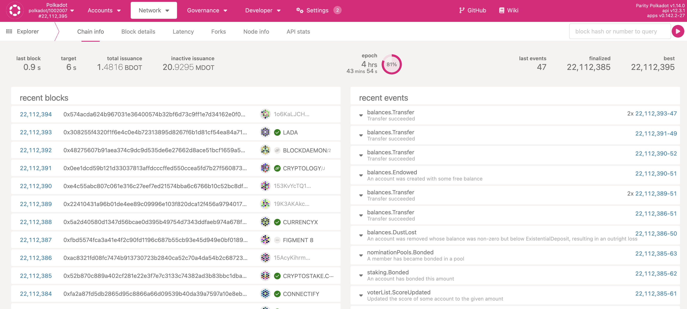
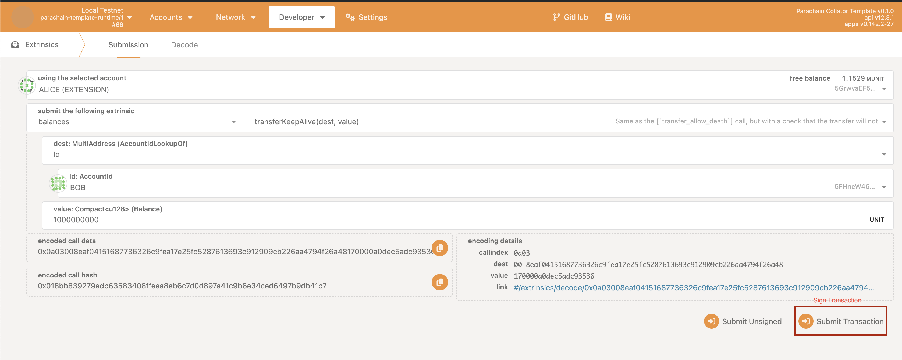
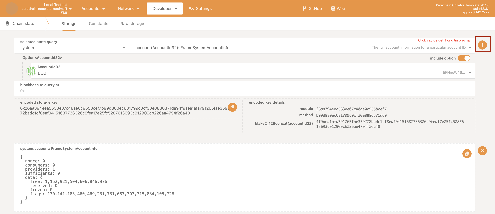
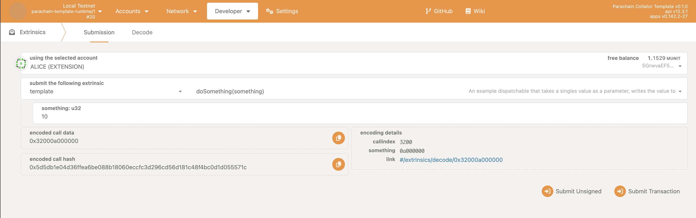

# Tương tác Substrate Node với Polkadot JS Explorer 

## Polkadot JS Explorer là gì 

Giao diện người dùng để người dùng có thể theo dõi và tương tác với mạng blockchain Polkadot và các parachains (chuỗi con) khác trong hệ sinh thái Polkadot.

### Các chức năng cơ bản của Polkadot JS Explorer 

+ Xem thông tin khối block ( block number, blockhash, validator, thời gian tạo khối) 

+ Xem thông tin logs, events ( transfer, staking, ... )  


+ Quản lý tài sản 

+ Khả năng tương tác với hợp đồng thông minh 

+ Tương tác với blockchain (local, testnet, mainnet) 




### Tương tác dev node với Polkadot JS Explorer 

#### Tạo 1 parachain template 

Cú pháp:

```bash
pop new parachain my-evm-chain pop -t evm
```

#### Chạy Substrate Node Template 

Cú pháp:

```bash
pop up parachain -f ./network.toml 
```


#### Truy cập polkadot js explorer 


https://polkadot.js.org/apps/#/explorer

-> Chọn Local Node Relay Chain 
+ Alice - Validator 

https://polkadot.js.org/apps/?rpc=ws://127.0.0.1:61125#/explorer

+ Bob - Validator 

https://polkadot.js.org/apps/?rpc=ws://127.0.0.1:61129#/explorer


-> Chọn Local Node Parachain 

+ Collator 
https://polkadot.js.org/apps/?rpc=ws://127.0.0.1:61133#/explorer


##### 1. Thực hiện hàm transfer từ `pallet_balances` 

Alice  transfer to Bob 




##### 2. Get thông tin balance của 1 account 


Lấy thông tin balance của Bob 




##### 3. Tương tác với pallet-template

+ Tạo `pallet-template` sử dụng pop cli 
+ Import thư viện `pallet_template` ở cargo workspace (Cargo.toml ỏ `root` folder)

```rust
pallet_template = { path = "./pallets/pallet-template", default-features = false }
```

+ Import thư viện `pallet_template` ở file `runtime/Cargo.toml` 
```rust
## Custom pallet
pallet_template = { workspace = true }
```

+ Add `std` feature của `pallet_template` ở file `runtime/Cargo.toml` 
```rust
[features]
default = ["std"]
std = [
    ...
	"pallet_template/std",
]
```

+ Thêm `pallet-template` vào `Runtime` ở file `runtime/lib.rs` 

```rust
// Create the runtime by composing the FRAME pallets that were previously configured.
construct_runtime!(
    // While this macro defines the pallets conforming the runtime,
    // the ones to be benchmarked need to be explicitly passed to `define_benchmarks!`.
    pub enum Runtime {
        // System support stuff.
        System: frame_system = 0,
        ParachainSystem: cumulus_pallet_parachain_system = 1,
        ...

        Template: pallet_template = 50,
    }
);
```


+ Implement `Config` của pallet-template cho `Runtime` ở file `runtime/lib.rs`

```rust
impl pallet_template::Config for Runtime {
    type RuntimeEvent = RuntimeEvent;
}
```

+ Build project 

```bash
pop build parachain
```

+ Call transaction trên polkadot js explorer 

Call hàm `doSomething` 





