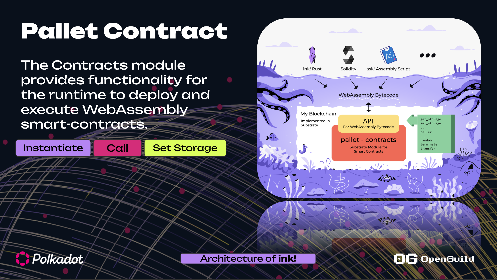

# Giới thiệu pallet contracts và contract node 

## Pallet contracts 


+ [`Pallet::instantiate_with_code`] - Deploys a new contract from the supplied Wasm binary,
optionally transferring some balance. This instantiates a new smart contract account with the supplied code and
calls its constructor to initialize the contract.

+ [`Pallet::instantiate`] - The same as `instantiate_with_code` but instead of uploading new
code an existing `code_hash` is supplied.

+ [`Pallet::call`] - Makes a call to an account, optionally transferring some balance.

+ [`Pallet::upload_code`] - Uploads new code without instantiating a contract from it.


Link code: https://github.com/paritytech/polkadot-sdk/blob/master/substrate/frame/contracts/src/lib.rs





## Contract Node Local 

### Tạo wasm contract appchain

```bash
pop new parachain my-contract-chain --template contracts
```


### Cách tích hợp pallet-contracts

#### Step 1: Import `pallet-contracts` vào `runtime/Cargo.toml` 

<details>
  <summary>runtime/Cargo.toml</summary>
```rust
[package]
name = "parachain-template-runtime"
version = "0.1.0"
authors.workspace = true
description = "Parachain runtime template"
license.workspace = true
homepage.workspace = true
repository.workspace = true
edition.workspace = true
publish = false

[package.metadata.docs.rs]
targets = ["x86_64-unknown-linux-gnu"]

[build-dependencies]
substrate-wasm-builder.workspace = true
docify.workspace = true

[dependencies]
# Substrate
    ...
pallet-contracts.workspace = true


# Polkadot
pallet-xcm.workspace = true
...

# Cumulus
cumulus-pallet-aura-ext.workspace = true
...

[features]
default = ["std"]
std = [
    ...
	"pallet-contracts/std",
    ...
]

runtime-benchmarks = [
    ...
	"pallet-contracts/runtime-benchmarks",
    ...
]

try-runtime = [
    ...
	"pallet-contracts/try-runtime",
    ...
]

```
</details>


#### Step 2: Add `pallet-contracts` vào `construct_runtime!`

<details>
  <summary>runtime/src/lib.rs</summary>
```rust
construct_runtime!(
    pub enum Runtime {
        // System support stuff.
        System: frame_system = 0,
        ParachainSystem: cumulus_pallet_parachain_system = 1,
        Timestamp: pallet_timestamp = 2,
        ParachainInfo: parachain_info = 3,
        ...
        // Contracts
        Contracts: pallet_contracts = 40,
    }
);
```
</details>


#### Step 3: implement `pallet_contracts::Config` for `Runtime

<details>
  <summary>runtime/src/configs/contracts.rs</summary>
```rust
// This is free and unencumbered software released into the public domain.
//
// Anyone is free to copy, modify, publish, use, compile, sell, or
// distribute this software, either in source code form or as a compiled
// binary, for any purpose, commercial or non-commercial, and by any
// means.
//
// In jurisdictions that recognize copyright laws, the author or authors
// of this software dedicate any and all copyright interest in the
// software to the public domain. We make this dedication for the benefit
// of the public at large and to the detriment of our heirs and
// successors. We intend this dedication to be an overt act of
// relinquishment in perpetuity of all present and future rights to this
// software under copyright law.
//
// THE SOFTWARE IS PROVIDED "AS IS", WITHOUT WARRANTY OF ANY KIND,
// EXPRESS OR IMPLIED, INCLUDING BUT NOT LIMITED TO THE WARRANTIES OF
// MERCHANTABILITY, FITNESS FOR A PARTICULAR PURPOSE AND NONINFRINGEMENT.
// IN NO EVENT SHALL THE AUTHORS BE LIABLE FOR ANY CLAIM, DAMAGES OR
// OTHER LIABILITY, WHETHER IN AN ACTION OF CONTRACT, TORT OR OTHERWISE,
// ARISING FROM, OUT OF OR IN CONNECTION WITH THE SOFTWARE OR THE USE OR
// OTHER DEALINGS IN THE SOFTWARE.
//
// For more information, please refer to <http://unlicense.org>

use crate::{
    deposit, Balance, Balances, Perbill, Runtime, RuntimeCall, RuntimeEvent, RuntimeHoldReason,
    Timestamp,
};
use frame_support::{
    parameter_types,
    traits::{ConstBool, ConstU32, Randomness},
};
use frame_system::{pallet_prelude::BlockNumberFor, EnsureSigned};

use pallet_balances::Call as BalancesCall;

pub enum AllowBalancesCall {}

impl frame_support::traits::Contains<RuntimeCall> for AllowBalancesCall {
    fn contains(call: &RuntimeCall) -> bool {
        matches!(
            call,
            RuntimeCall::Balances(BalancesCall::transfer_allow_death { .. })
        )
    }
}

// randomness-collective-flip is insecure. Provide dummy randomness as placeholder for the
// deprecated trait. https://github.com/paritytech/polkadot-sdk/blob/9bf1a5e23884921498b381728bfddaae93f83744/substrate/frame/contracts/mock-network/src/parachain/contracts_config.rs#L45
pub struct DummyRandomness<T: pallet_contracts::Config>(sp_std::marker::PhantomData<T>);

impl<T: pallet_contracts::Config> Randomness<T::Hash, BlockNumberFor<T>> for DummyRandomness<T> {
    fn random(_subject: &[u8]) -> (T::Hash, BlockNumberFor<T>) {
        (Default::default(), Default::default())
    }
}

fn schedule<T: pallet_contracts::Config>() -> pallet_contracts::Schedule<T> {
    pallet_contracts::Schedule {
        limits: pallet_contracts::Limits {
            runtime_memory: 1024 * 1024 * 1024,
            ..Default::default()
        },
        ..Default::default()
    }
}

parameter_types! {
    pub const DepositPerItem: Balance = deposit(1, 0);
    pub const DepositPerByte: Balance = deposit(0, 1);
    pub Schedule: pallet_contracts::Schedule<Runtime> = schedule::<Runtime>();
    pub const DefaultDepositLimit: Balance = deposit(1024, 1024 * 1024);
    pub const CodeHashLockupDepositPercent: Perbill = Perbill::from_percent(0);
    pub const MaxDelegateDependencies: u32 = 32;
}

impl pallet_contracts::Config for Runtime {
    type Time = Timestamp;
    type Randomness = DummyRandomness<Self>;
    type Currency = Balances;
    type RuntimeEvent = RuntimeEvent;
    type RuntimeCall = RuntimeCall;

    /// The safest default is to allow no calls at all.
    ///
    /// Runtimes should whitelist dispatchables that are allowed to be called from contracts
    /// and make sure they are stable. Dispatchables exposed to contracts are not allowed to
    /// change because that would break already deployed contracts. The `RuntimeCall` structure
    /// itself is not allowed to change the indices of existing pallets, too.
    type CallFilter = AllowBalancesCall;
    type DepositPerItem = DepositPerItem;
    type DepositPerByte = DepositPerByte;
    type CallStack = [pallet_contracts::Frame<Self>; 23];
    type WeightPrice = pallet_transaction_payment::Pallet<Self>;
    type WeightInfo = pallet_contracts::weights::SubstrateWeight<Self>;
    type ChainExtension = ();
    type Schedule = Schedule;
    type AddressGenerator = pallet_contracts::DefaultAddressGenerator;
    // This node is geared towards development and testing of contracts.
    // We decided to increase the default allowed contract size for this
    // reason (the default is `128 * 1024`).
    //
    // Our reasoning is that the error code `CodeTooLarge` is thrown
    // if a too-large contract is uploaded. We noticed that it poses
    // less friction during development when the requirement here is
    // just more lax.
    type MaxCodeLen = ConstU32<{ 256 * 1024 }>;
    type DefaultDepositLimit = DefaultDepositLimit;
    type MaxStorageKeyLen = ConstU32<128>;
    type MaxDebugBufferLen = ConstU32<{ 2 * 1024 * 1024 }>;
    type UnsafeUnstableInterface = ConstBool<true>;
    type CodeHashLockupDepositPercent = CodeHashLockupDepositPercent;
    type MaxDelegateDependencies = MaxDelegateDependencies;
    type RuntimeHoldReason = RuntimeHoldReason;

    type Environment = ();
    type Debug = ();
    type ApiVersion = ();
    type Migrations = ();
    type Xcm = pallet_xcm::Pallet<Self>;
    type UploadOrigin = EnsureSigned<Self::AccountId>;
    type InstantiateOrigin = EnsureSigned<Self::AccountId>;
}

```
</details>


#### Step 4: implement `pallet contracts runtime api`

<details>
  <summary>runtime/src/apis.rs</summary>
```rust
impl_runtime_apis! {

    ... 

    impl pallet_contracts::ContractsApi<Block, AccountId, Balance, BlockNumber, Hash, EventRecord>
        for Runtime
    {
        fn call(
            origin: AccountId,
            dest: AccountId,
            value: Balance,
            gas_limit: Option<Weight>,
            storage_deposit_limit: Option<Balance>,
            input_data: Vec<u8>,
        ) -> pallet_contracts::ContractExecResult<Balance, EventRecord> {
            let gas_limit = gas_limit.unwrap_or(RuntimeBlockWeights::get().max_block);
            Contracts::bare_call(
                origin,
                dest,
                value,
                gas_limit,
                storage_deposit_limit,
                input_data,
                CONTRACTS_DEBUG_OUTPUT,
                CONTRACTS_EVENTS,
                pallet_contracts::Determinism::Enforced,
            )
        }

        fn instantiate(
            origin: AccountId,
            value: Balance,
            gas_limit: Option<Weight>,
            storage_deposit_limit: Option<Balance>,
            code: pallet_contracts::Code<Hash>,
            data: Vec<u8>,
            salt: Vec<u8>,
        ) -> pallet_contracts::ContractInstantiateResult<AccountId, Balance, EventRecord>
        {
            let gas_limit = gas_limit.unwrap_or(RuntimeBlockWeights::get().max_block);
            Contracts::bare_instantiate(
                origin,
                value,
                gas_limit,
                storage_deposit_limit,
                code,
                data,
                salt,
                CONTRACTS_DEBUG_OUTPUT,
                CONTRACTS_EVENTS,
            )
        }

        fn upload_code(
            origin: AccountId,
            code: Vec<u8>,
            storage_deposit_limit: Option<Balance>,
            determinism: pallet_contracts::Determinism,
        ) -> pallet_contracts::CodeUploadResult<Hash, Balance>
        {
            Contracts::bare_upload_code(origin, code, storage_deposit_limit, determinism)
        }

        fn get_storage(
            address: AccountId,
            key: Vec<u8>,
        ) -> pallet_contracts::GetStorageResult {
            Contracts::get_storage(address, key)
        }
    }

    ...
}

```
</details>


## Ví dụ một số appchain
+ POP network: https://github.com/r0gue-io/pop-node/blob/main/runtime/testnet/src/lib.rs#L623
+ Aleph Zero: https://github.com/aleph-zero-foundation/aleph-node/blob/main/bin/runtime/src/lib.rs#L963
+ ... 


