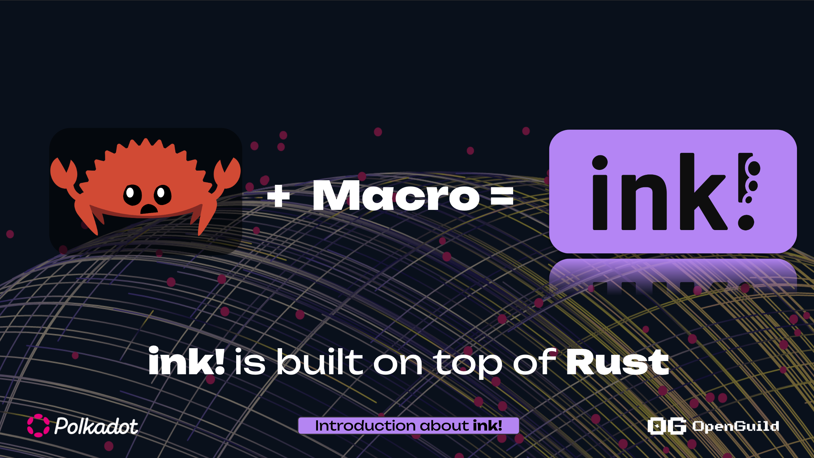
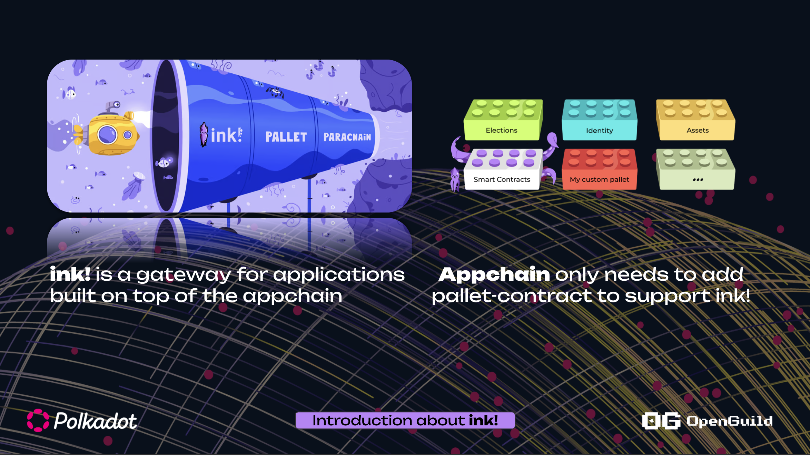
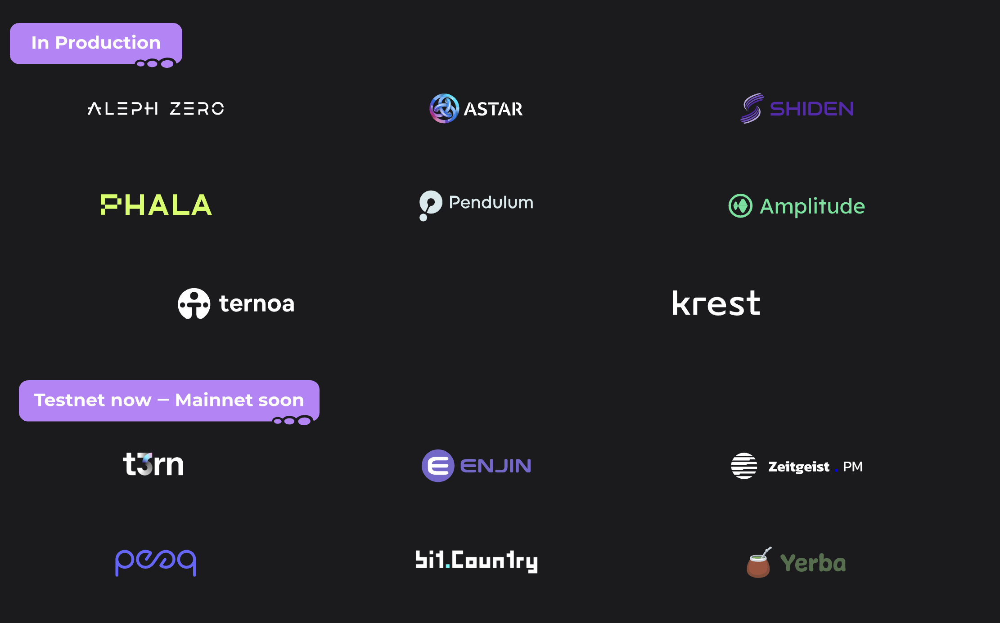
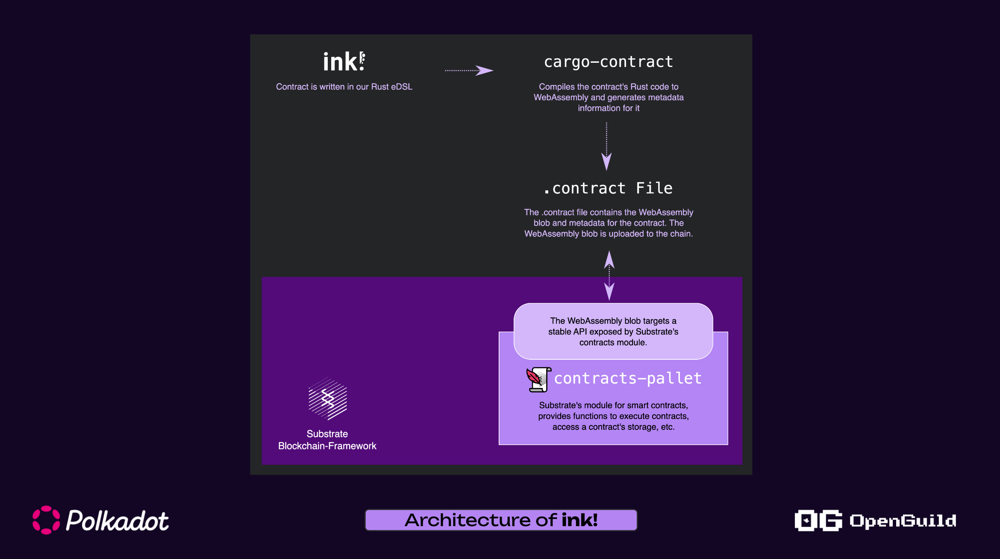

# Ngôn ngữ ink! là gì?
+ Ink! là ngôn ngữ lập trình smart contract trên hệ sinh thái Polkadot 
+ Do đội ngũ `Parity` maintain
+ Build ra wasm 

+ Ink! = Rust + macros

## Môi trường có thể deploy/tương tác ink! smart contract 

Substrate có tích hợp `pallet-contracts` (https://github.com/paritytech/polkadot-sdk/tree/master/substrate/frame/contracts)

## ink! Production 

## How it work 

## Tài liệu tham khảo 
+ https://use.ink/

