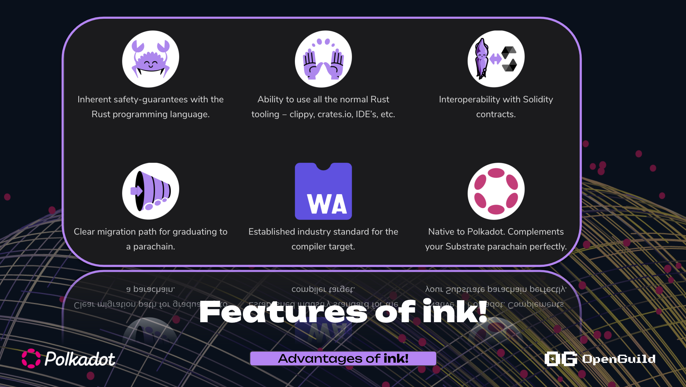

# Tại sao sử dụng ink!?

## Các đặc trung của ink! 

+ **Rust**: ink! được viết bằng Rust, nên kế thừa những feature của Rust. Người dùng Rust dễ dàng làm việc với ink!

+ **WebAssembly**: ink! contract được compile sang wasm ,cho phép chạy trên các hệ blockchain hỗ trợ wasm 

+ **Polkadot Native**: ink! contract được thiết kế cho Polkadot , chỉ cần  tích hợp `pallet-contracts` thì có thể chạy ink! contract

+ **Macro**: ink! giảm thiểu việc phát triển 1 smart contract thông qua macro , ví dụ macro `#[ink::storage]` giúp định nghĩa on-chain storage

+ **Khả năng tương tác**: ink! contract có thể tương tác với runtime (pallets), cross-chain 

## So sánh ink! với solidity 

| Đặc điểm | Ink! | Solidity |
| --- | --- | --- | 
| Tính linh hoạt và tính năng | Sử dụng ngôn ngữ rust, kế thừa các features mạnh mẽ của Rust, hạn chế lỗi ở Runtime   | Ngôn ngữ mới (tương tự javascript), tính năng an toàn chưa hoàn thiện |
| Developer Experience | Learning Curve (vì phải học Rust)  | Cú pháp đơn giản, dễ hiểu, dễ code |
| Môi trường phát triển | Dựa trên môi trường phát triển Rust, tool hỗ trợ chưa nhiều | Remix IDE , tool hỗ trợ rất nhiều |
| Cộng đồng | Đang phát triển  | Phát triển mạnh, top 1 ngôn ngữ lập trình smart contract hệ evm|

## Tài liệu tham khảo: 

+ https://use.ink/ink-vs-solidity/

