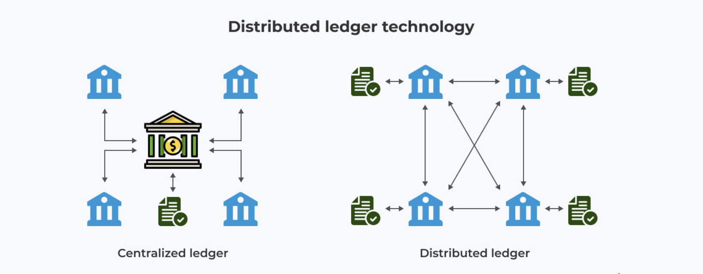
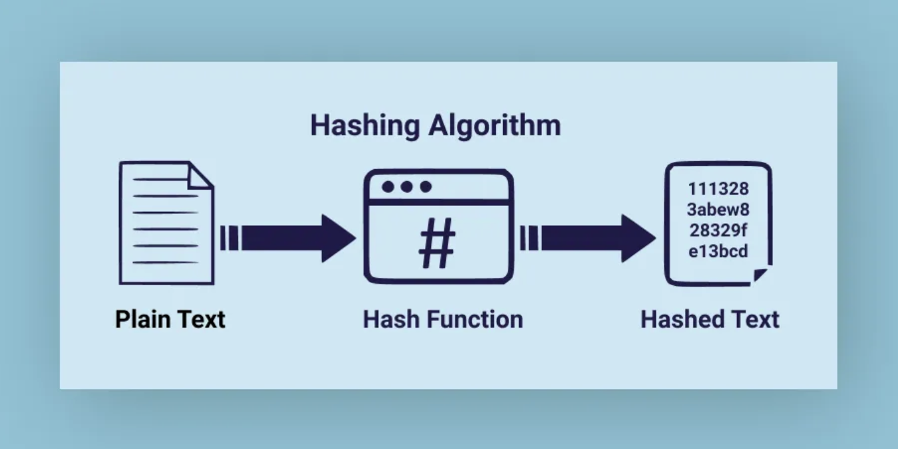
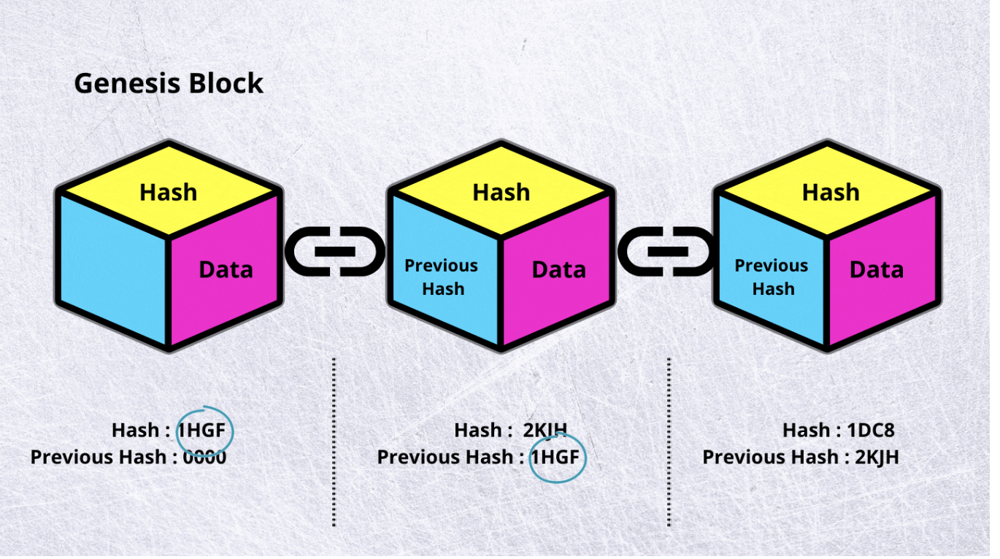
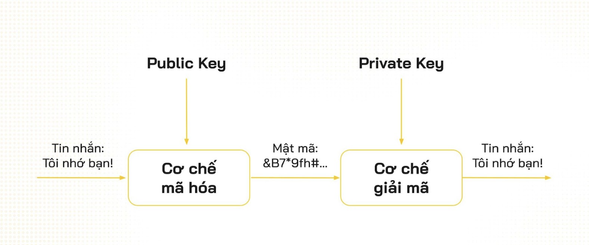

# Blockchain cơ bản 

## Blockchain là gì 
Sổ cái phân tán (Distributed Ledger) được bảo mật bằng mật mã học (cryptography)

### Distributed Ledger

> Sổ cái là tập hợp các giao dịch. Sổ cái phân tán có thể chia sẻ và đồng bộ chung với các `node` trên mạng lưới.

### Cryptography

> Mật mã học sử dụng thuật toán để che giấu thông tin -> trao đổi thông tin an toàn mà không bị bên thứ ba can thiệp 

#### Hàm băm 

> Hàm biến đổi một chiều biến đầu vào(file, video, ...) thành đầu ra có kích thước cố định 

Ví dụ: 
https://www.md5hashgenerator.com/

Đặc điểm: 
+ Inverse is very difficult to compute 
+ Deterministic output : X1 -> Y1, X2 ->Y2
+ Very Difficult to find collision: X1 -> Y, X2 -> Y

Refer: https://medium.com/nybles/hashing-algorithms-d10171ca2e89

### Các đặc điểm của DLT ( Distributed Ledger Technology)

+ Decentralize 
+ Transparent 
+ Immutable 

Refer: https://4irelabs.com/articles/choosing-a-distributed-ledger-technology/

## Thành phần của blockchain 

- **Blocks**: Lưu thông tin của nhiều giao dịch 
- **Chain**: Chuỗi là một tập hợp các khối. Mỗi khối chứa băm của khối trước đó
- **Nodes**: Là các máy tính tham gia vào mạng blockchain 

Refer: https://medium.com/the-crypto-block/8-concepts-that-will-help-you-understand-blockchain-technology-c51b0941bf19

## Cách thức hoạt động của blockchain

## Các khái niệm cơ bản của blockchain

### Consensus

> "consensus" (hay "đồng thuận") đề cập đến cơ chế hoặc quy trình mà các node trong mạng blockchain đạt được sự đồng ý về trạng thái của sổ cái 

### P2P
>  mô hình mạng ngang hàng trong đó các node có thể giao tiếp và trao đổi dữ liệu trực tiếp với nhau mà không cần thông qua node trung gian

### Smart Contract 
> Smart contract (hợp đồng thông minh) cho phép tự động thực thi các điều khoản của hợp đồng mà không cần sự can thiệp của bên thứ ba

### Keypair

#### Public Key (Khóa Công Khai)
> Là khóa được công khai cho tất cả mọi người. 

#### Private Key (Khóa Bí Mật)
> Là khóa được giữ bí mật và chỉ có người sở hữu biết. 

#### Cách sử dụng cặp khoá Public Key and Private Key

Refer: https://coin98.net/public-key-la-gi

