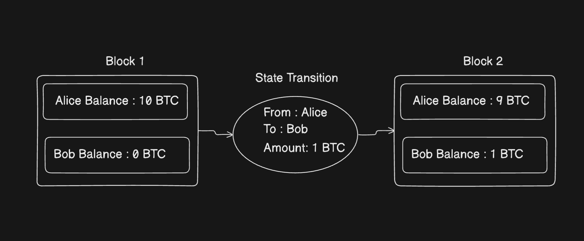
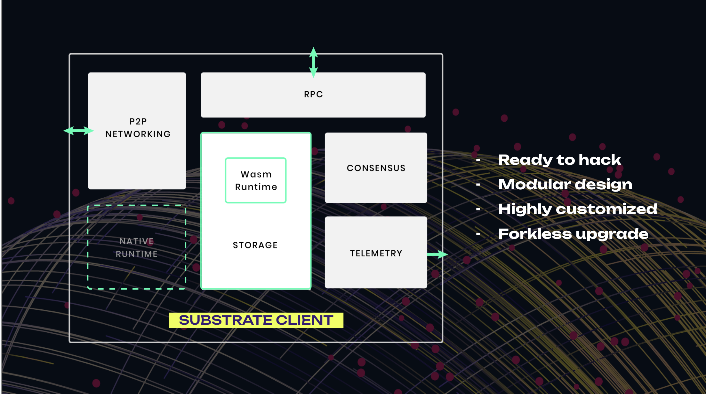

# Substrate Node Architecture 

Gồm 2 phần chính đó là `Client` và `Runtime` 

## Client 
+ Là 1 phần của `node` xử lý các vấn đề low level của blockchain như là p2p, transaction, rpc, storage, ... 

## Runtime 

+ Là 1 phần của `node` xử lý các state transition function ( hàm dịch chuyển trạng thái như là state machine)

+ State Transition Function :hàm dịch chuyển trạng thái, thay đổi trạng thái `n` sang trạng thái `n+1` 

Ví dụ:

## Architecture 

Overview Architecture

### RPC (Remote Procedure Call)

Các node blockchain chấp nhận các yêu cầu HTTP và WebSocket đến để cho phép người dùng blockchain tương tác với mạng lưới

### Consensus
Substrate hỗ trợ một số consensus:
+ POS/ NPOS : Polkadot 
+ POA: Substrate Node Template 
+ POW: https://github.com/Polkadot-Blockchain-Academy/Academy-PoW

## Storage
+ Ledger, lưu tất cả các thông tin của blockchain

### Telemetry
+ Kiểm tra tình trạng của validators (số peer, validator nào tạo ra block , …)
+ https://telemetry.polkadot.io

### Wasm 

https://en.wikipedia.org/wiki/WebAssembly

#### Native runtime

Native runtime là runtime được biên dịch trực tiếp thành mã máy, phù hợp với kiến trúc của CPU trên thiết bị đang chạy. 
Điều này có nghĩa là native runtime chạy như một chương trình nhị phân gốc (native binary) trên máy chủ mà không cần lớp trung gian nào

#### Wasm runtime

Wasm runtime là runtime được biên dịch thành WebAssembly (Wasm), một định dạng mã bytecode trung gian được thiết kế để chạy trên nhiều loại kiến trúc phần cứng khác nhau thông qua một máy ảo (Virtual Machine)

#### So sánh 

| **Đặc điểm**           | **Native Runtime**                                             | **Wasm Runtime**                                              |
|------------------------|----------------------------------------------------------------|---------------------------------------------------------------|
| **Hiệu suất**          | Thường nhanh hơn do chạy trực tiếp trên phần cứng.              | Chậm hơn vì cần chạy qua máy ảo Wasm.                           |
| **Sử dụng**            | Substrate ưu tiên sử dụng native runtime | Được sử dụng như phương án dự phòng khi phiên bản native runtime không tương ứng |
| **Cập nhật**           | Yêu cầu cập nhật phần mềm node khi có thay đổi trong runtime.  | Có thể cập nhật trực tiếp trên chuỗi mà không cần cập nhật phần mềm node. |

