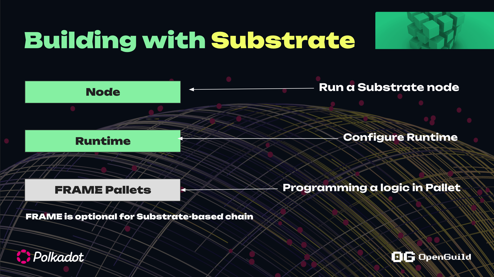
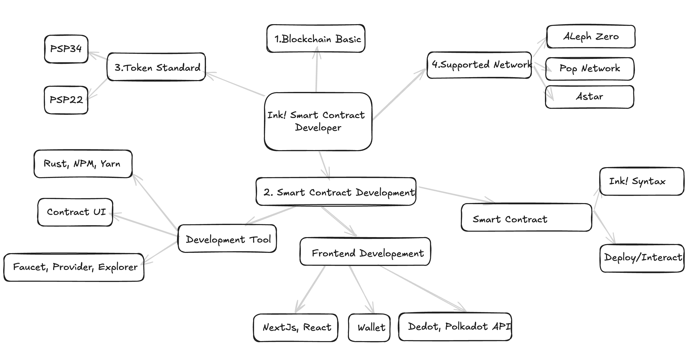

# Substrate Roadmap

## Blockchain Engineer
1. Solochain 
2. Relaychain/Parachain 

[Substrate Roadmap](https://roadmap.sh/r/embed?id=659a4664ae22c12523369370)

[Substrate Roadmap](https://www.web3roadmap.com/polkadot-sdk)

## Smart contract Developer 
2 ngôn ngữ chính là Solidity và Ink! (Rust)

1. Roadmap cho Solidity 

+ https://github.com/frankiefab100/Web3.0-Roadmap
+ https://github.com/Quillhash/Smart-Contract-Developer-Roadmap

2. Roadmap cho Ink!

