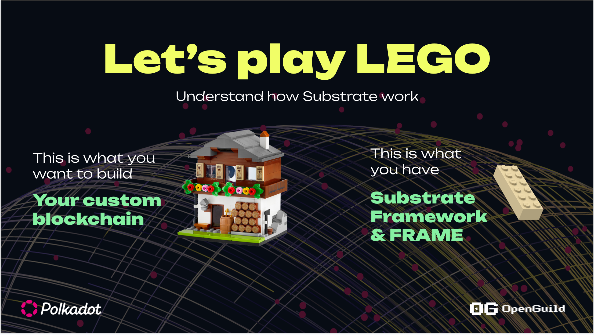
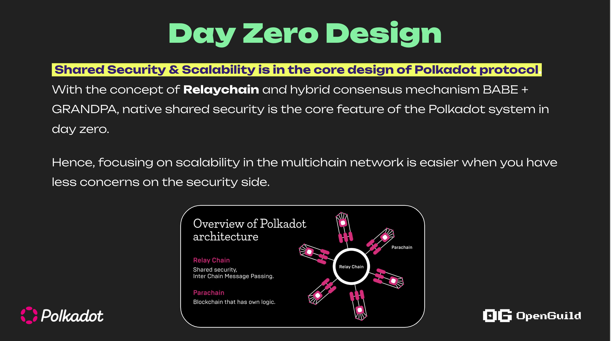

# Substrate là gì ? 

## Định nghĩa 

+ Thành phần core của Polkadot SDK 

+ Substrate là 1 SDK cho phép nhà phát triển xây dựng các ứng dụng blockchain cụ thể (application specific blockchain)
ví dụ như DEFI, NFT, Identity, Oracle, ... mà không tập trung quá nhiều những thành phần low-level của blockchain (Consensus, P2P, Database, Cryptography ,...)

+ Được viết bằng ngôn ngữ Rust
 

## Các khái niệm cơ bản của Polkadot Ecosystem 

### Relaychain/ Parachain

> Relay Chain là chuỗi chính trong mạng Polkadot, chịu trách nhiệm về bảo mật chung, đồng thuận và khả năng tương tác giữa các parachains

> Parachain là các blockchain độc lập, nhưng được kết nối với Relay Chain, và tận dụng bảo mật, đồng thuận, và khả năng tương tác do Relay Chain cung cấp

### XCM

+ XCM (Cross-Consensus Messaging) là một giao thức truyền thông trong hệ sinh thái Polkadot và Kusama. 
+ Chia sẻ thông tin và tài sản an toàn giữa Relaychain và Parachain 

## Sử dụng Substrate cho mục đích

+ Xây dựng solochain như Aleph Zero, Peaq
+ Xây dựng relaychain/parachain
+ Phát triển smart contract 

## Một số Dự án sử dụng Substrate

| Tên dự án | Ứng dụng cụ thể |
| --- | --- |
| Polkadot | Blockchain Layer-0  |
| Moonbeam | EVM-compatible like Ethereum  |
| POP Network | Wasm Smart Contract  |
| Unique Network | NFT   |
| Phala | Oracle   |
| ... | ...   |

## Tài liệu tham khảo 
+ https://openguild.wtf/blog/polkadot/polkadot-sdk-substrate
+ https://docs.substrate.io/quick-start/substrate-at-a-glance/

