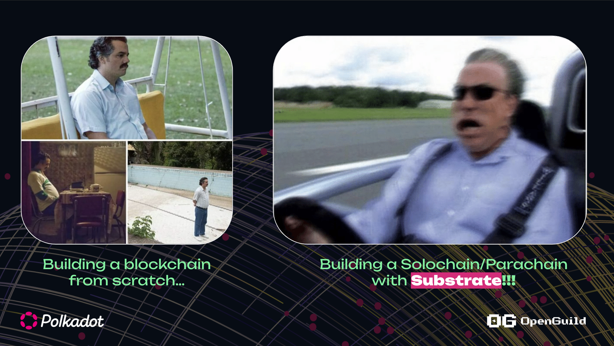

# Tại sao sử dụng Substrate ?

1. **Modular and Flexible Framework**
Tuỳ chỉnh nhanh chóng, tập trung xây dựng ứng dụng Blockchain

2. **Chi phí vận hành thấp** 

3. **Dễ dàng nâng cấp logic**

4. **Cộng đồng open-source**

+ Github: https://github.com/paritytech/polkadot-sdk, ...
+ https://openguild.wtf/bounty
+ https://polkadot.polkassembly.io/bounties
+ https://forum.polkadot.network/

