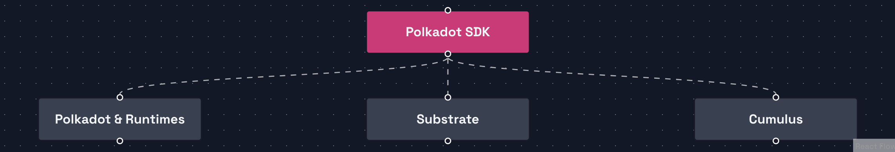
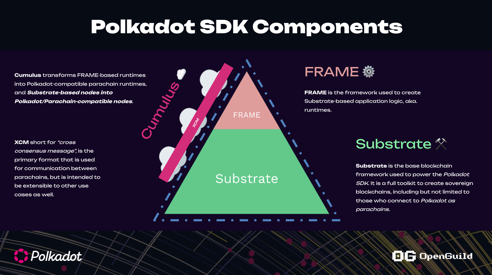

# Overview Polkadot SDK 

## Polkadot SDK là gì? 
Polkadot SDK là 1 repository gồm các core thư viện để xây dựng Polkadot, Parachain và blockchain tuỳ chỉnh 

Link github: https://github.com/paritytech/polkadot-sdk

## Lịch sử của Polkadot SDK 
1. Ban đầu là Substrate SDK, nhưng sau này re-brand sang tên `Polkadot SDK` 

2. Gồm các repo chính:
+ https://github.com/paritytech/substrate
+ https://github.com/paritytech/cumulus
+ https://github.com/paritytech/polkadot

## Polkadot SDK là 1 repository gồm có substrate, cumulus, Polkadot/Kusama

+ Substrate: Build solochain 
+ Cumulus: Build parachain
+ Polkadot: Build Polkadot blockchain 

-> All-in-one repository 

