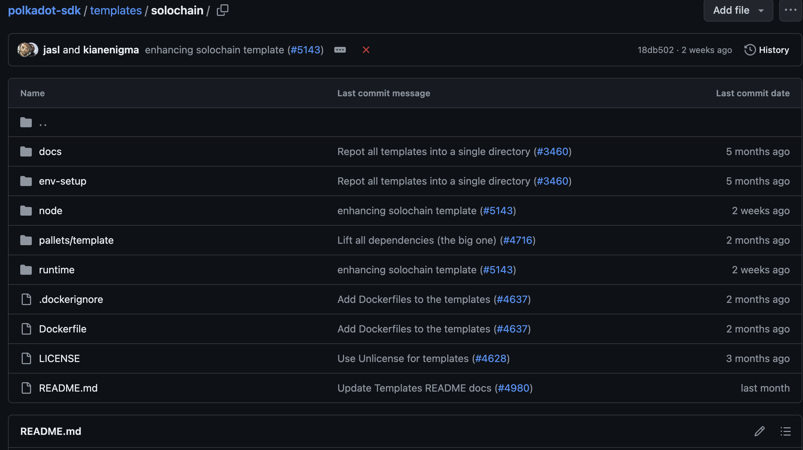
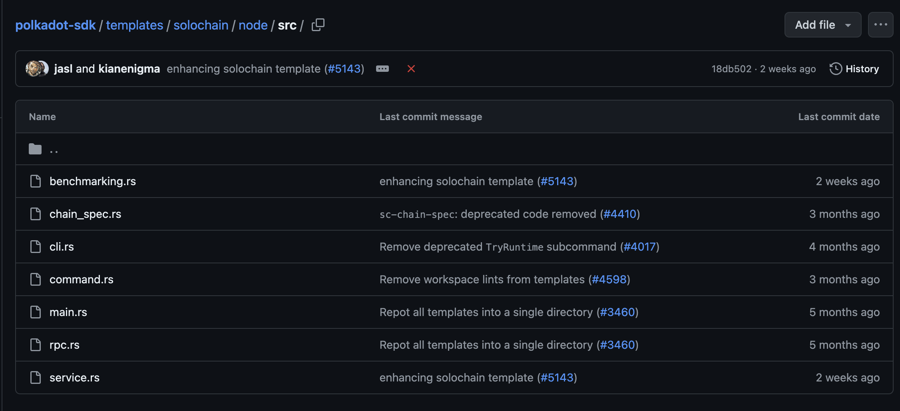
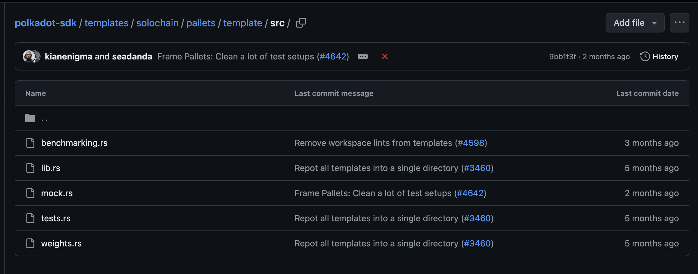
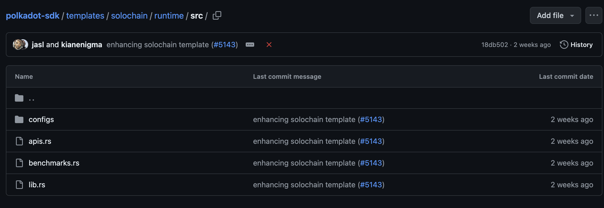
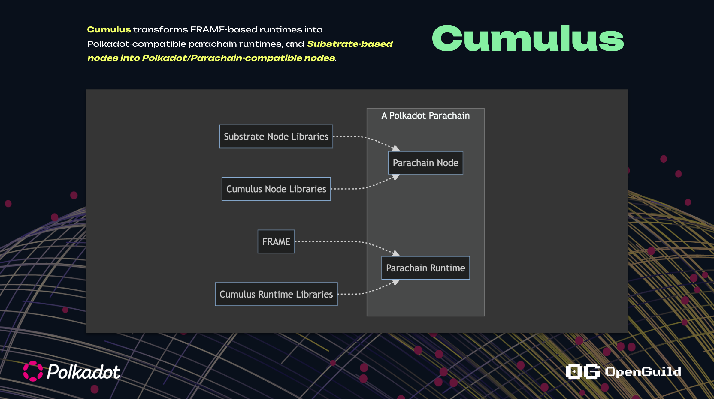

# Explorer Solochain Template




## Node  
+ Binary executable (file chạy node blockchain ) -> thực thi logic của runtime 
+ Tương tác với các node khác dựa trên p2p , thực hiện cơ chế consensus
+ Expose RPC, cho phép client tương tác với blockchain 




+ `benchmarking.rs` thực thi benchmark ( tính toán độ phức tạp của 1 transaction)
+ `chain_spec.rs`: Mô tả genesis block 
+ `cli.rs` : Định nghĩa các loại command của node blockchain 
+ `command.rs` : Implement command 
+ `main.rs`
+ `rpc.rs` : Định nghĩa rpc methods
+ `service.rs` : Implement node 


## Pallets 
Nơi chứa các pallets, mảnh ghép của runtime




+ `lib.rs` : Định nghĩa logic của 1 pallet 
+ `mock.rs` : Mock runtime dành cho việc test 
+ `tests.rs` : Định nghĩa test case  

### Phân tích code mẫu trong pallet-template


```rust
// Khai báo rằng Pallet sẽ không hỗ trợ standard library của Rust bởi 
// vì Pallet được tích hợp vào Runtime của Substrate và 
// Runtime sẽ được compile sang WASM
#![cfg_attr(not(feature = "std"), no_std)]

pub use pallet::*;

#[cfg(test)]
mod mock;

#[cfg(test)]
mod tests;

#[cfg(feature = "runtime-benchmarks")]
mod benchmarking;
pub mod weights;
pub use weights::*;

#[frame_support::pallet]
pub mod pallet {
	use super::*;
	use frame_support::pallet_prelude::*;
	use frame_system::pallet_prelude::*;

    //Macro này là bất buộc khi bạn bắt đầu viết bất kỳ pallet nào, 
    // nó cho phép bạn khai báo các thông tin của Pallet
	#[pallet::pallet]
	pub struct Pallet<T>(_);

    // Macro khai báo các cấu hình và parameters yêu cầu từ Runtime khi pallet được sử dụng ở phía Runtime
	#[pallet::config]
	pub trait Config: frame_system::Config {
		/// Because this pallet emits events, it depends on the runtime's definition of an event.
		type RuntimeEvent: From<Event<Self>> + IsType<<Self as frame_system::Config>::RuntimeEvent>;
		/// Type representing the weight of this pallet
		type WeightInfo: WeightInfo;
	}

    // Khai báo cho loại dữ liệu được lưu trữ trong onchain storage
	#[pallet::storage]
	#[pallet::getter(fn something)]
	pub type Something<T> = StorageValue<_, u32>;

    // Định nghĩa cho các sự kiện có thể được gọi từ Pallet
	#[pallet::event]
	#[pallet::generate_deposit(pub(super) fn deposit_event)]
	pub enum Event<T: Config> {
		SomethingStored { something: u32, who: T::AccountId },
	}

    // Khai báo các loại lỗi mà pallet này có thể trả về
	#[pallet::error]
	pub enum Error<T> {
		NoneValue,
		StorageOverflow,
	}

    // nơi khai báo các hàm  extrinsic/transaction để thay đổi trạng thái của blockchain
	#[pallet::call]
	impl<T: Config> Pallet<T> {
        // Định nghĩa thứ tự của extrinsic 
		#[pallet::call_index(0)]
        // Định nghĩa Weight 
		#[pallet::weight(T::WeightInfo::do_something())]
		pub fn do_something(origin: OriginFor<T>, something: u32) -> DispatchResult {
            // yêu cầu user phải ký extrinsic
			let who = ensure_signed(origin)?;
            // Lưu thông tin on chain storage
			<Something<T>>::put(something);
			Self::deposit_event(Event::SomethingStored { something, who });
			Ok(())
		}

		#[pallet::call_index(1)]
		#[pallet::weight(T::WeightInfo::cause_error())]
		pub fn cause_error(origin: OriginFor<T>) -> DispatchResult {
			let _who = ensure_signed(origin)?;
            // Lấy thông tin on-chain storage
			match <Something<T>>::get() {
                // Trả về lỗi nếu thông tin on-chain rỗng 
				None => return Err(Error::<T>::NoneValue.into()),
                // Update thông tin on-chain
				Some(old) => {
					let new = old.checked_add(1).ok_or(Error::<T>::StorageOverflow)?;
					<Something<T>>::put(new);
					Ok(())
				},
			}
		}
	}
}


```


## Runtime 

+ `configs` : Implement hành vi của pallet( impl `<pallet>`::Config for Runtime) cho Runtime 
+ `apis.rs`: Định nghĩa Runtime API
+ `lib.rs` : Định nghĩa các kiểu dữ liệu cho blockchain, tập hợp các FRAME Pallets thành 1 Runtime 


### Add pallet-template vào Runtime 

```rust
#[frame_support::runtime]
mod runtime {
	#[runtime::runtime]
	#[runtime::derive(
		RuntimeCall,
		RuntimeEvent,
		RuntimeError,
		RuntimeOrigin,
		RuntimeFreezeReason,
		RuntimeHoldReason,
		RuntimeSlashReason,
		RuntimeLockId,
		RuntimeTask
	)]
	pub struct Runtime;

	#[runtime::pallet_index(0)]
	pub type System = frame_system;

	#[runtime::pallet_index(1)]
	pub type Timestamp = pallet_timestamp;

	#[runtime::pallet_index(2)]
	pub type Aura = pallet_aura;

	#[runtime::pallet_index(3)]
	pub type Grandpa = pallet_grandpa;

	#[runtime::pallet_index(4)]
	pub type Balances = pallet_balances;

	#[runtime::pallet_index(5)]
	pub type TransactionPayment = pallet_transaction_payment;

	#[runtime::pallet_index(6)]
	pub type Sudo = pallet_sudo;

	//  Khai báo pallet mẫu được sử dụng vào Runtime
	#[runtime::pallet_index(7)]
	pub type TemplateModule = pallet_template;
}
```


### Khai báo Type của pallet-template vào trong Runtime

```
impl pallet_template::Config for Runtime {
	type RuntimeEvent = RuntimeEvent;
	type WeightInfo = pallet_template::weights::SubstrateWeight<Runtime>;
}

```



# Explorer Parachain Template

Cấu trúc khá tương tự so với solochain , nhưng sẽ cấu hình liên quan tới các thành phần của parachain, kết nối parachain với relaychain, giao tiếp XCM





## Tài liệu tham khảo 

+ https://github.com/paritytech/polkadot-sdk/tree/master/templates
+ https://github.com/OpenZeppelin/polkadot-runtime-templates
+ https://openguild.wtf/blog/polkadot/code-breakdown-pallet-template
+ https://openguild.wtf/blog/polkadot/code-breakdown-substrate-node


