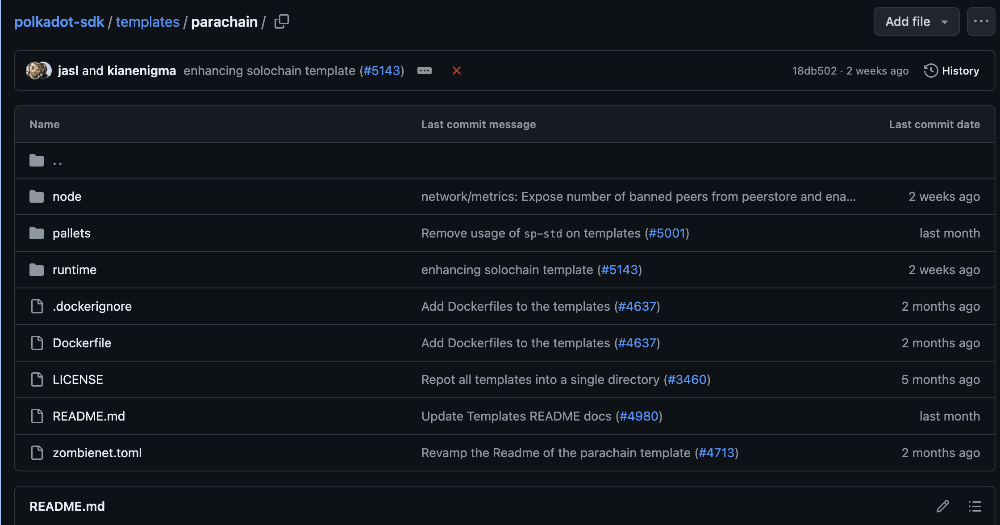

# Explorer Solochain Template

## Node  
+ Binary executable (file chạy node blockchain ) -> thực thi logic của runtime 
+ Tương tác với các node khác dựa trên p2p , thực hiện cơ chế consensus
+ Expose RPC, cho phép client tương tác với blockchain 

+ `benchmarking.rs` thực thi benchmark ( tính toán độ phức tạp của 1 transaction)
+ `chain_spec.rs`: Mô tả genesis block 
+ `cli.rs` : Định nghĩa các loại command của node blockchain 
+ `command.rs` : Implement command 
+ `main.rs`
+ `rpc.rs` : Định nghĩa rpc methods
+ `service.rs` : Implement node 

## Pallets 
Nơi chứa các pallets, mảnh ghép của runtime

+ `lib.rs` : Định nghĩa logic của 1 pallet 
+ `mock.rs` : Mock runtime dành cho việc test 
+ `tests.rs` : Định nghĩa test case  

## Runtime 

+ `configs` : Implement hành vi của pallet( impl `<pallet>`::Config for Runtime) cho Runtime 
+ `apis.rs`: Định nghĩa Runtime API
+ `lib.rs` : Định nghĩa các kiểu dữ liệu cho blockchain, tập hợp các FRAME Pallets thành 1 Runtime 

# Explorer Parachain Template

Cấu trúc khá tương tự so với solochain , nhưng sẽ cấu hình liên quan tới các thành phần của parachain, kết nối parachain với relaychain, giao tiếp XCM

## Tài liệu tham khảo 

+ https://github.com/paritytech/polkadot-sdk/tree/master/templates
+ https://github.com/OpenZeppelin/polkadot-runtime-templates

