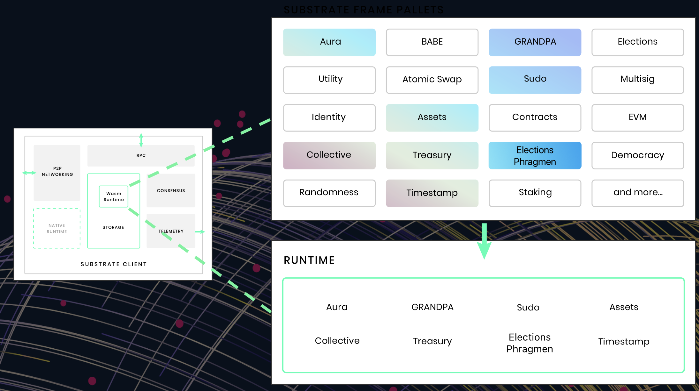
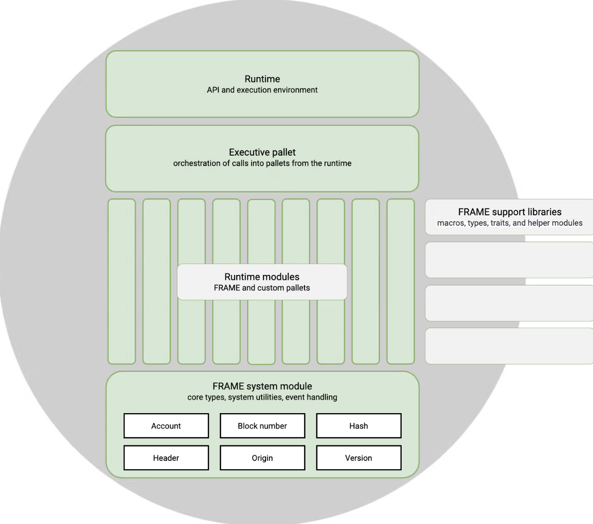

# FRAME

## Định nghĩa 

+ FRAME ( Framework for Runtime Aggregation of Modularized Entities ) là tập hợp các module, các core thư viện để
xây dụng Runtime 

+ FRAME sẽ gồm các pallets (modules) , mỗi pallets có mỗi chức năng khác nhau 

Ví dụ:
+ pallet-evm : deploy hoặc tương tác evm smart contract 
+ pallet-sudo : trao quyền admin -> admin thể mint coins, thực hiện các chức năng thường dành cho core team , ...

## Core FRAME (Pallets hệ thống)

+ Cung cấp sẵn bởi Substrate 

1. **frame_system**

+ Cung cấp low-level type như `Account` , `BlockNumber`, `Hash`, ...
+ Định nghĩa các kiểu on chain storage

[frame_system](https://paritytech.github.io/polkadot-sdk/master/frame_system/index.html)

2. **frame_support**
+ Cung cấp macro Rust, kiểu dữ liệu hash, modules

[frame_support](https://paritytech.github.io/polkadot-sdk/master/frame_support/index.html)

3. **frame_executive**

+ Lớp điều phối cho môi trường runtime, nghĩa là khi 1 user call 1 transaction thì executive sẽ phân phối transaction đó tương ứng với pallet trong môi trường runtime
+ Kiểm tra transaction có hợp lệ hay không (khi users/ internal transaction thực thi)
+ Tạo block 
+ Apply transactions ( khi users/ internal transaction thực thi)
+ Execute a block ( Đưa transactions vào trong block)
+ Finalize a block ( Đóng gói thành 1 block hoàn chỉnh sau khi được validate bởi consensus) 

[frame_executive](https://paritytech.github.io/polkadot-sdk/master/frame_executive/index.html)

## Functional Pallets ( Pallets chức năng)

+ Substrate framework bao gồm rất nhiều các pallet chức năng khác nhau nhằm cung cấp các tính năng được sử dụng bởi các thành phần trong mạng blockchain

Ví dụ:

+ pallet_assets (được sử dụng để giải quyết các vấn đề về fungible assets)
+ pallet_contracts (được sử dụng để giúp runtime của bạn có thể hỗ trợ hợp đồng thông minh)

## Parachain Pallets ( Pallets parachain)

+ Cung cấp tính năng cụ thể cho các blockchain có dự định để kết nối tới Relay Chain, trở thành một Parachain
+ Các pallet parachain này thuộc bộ công cụ phát triển Cumulus

##  Cách xây dựng Runtime 

Cơ bản gồm 2 bước: 

1. Sử dụng core FRAME, core library để xây dựng Pallet 
2. Tập hợp core FRAME, và Pallet -> Runtime hoàn chỉnh 

## Tài liệu tham khảo 

+ https://docs.substrate.io/reference/frame-pallets/
+ https://docs.substrate.io/reference/frame-macros/
+ https://openguild.wtf/blog/polkadot/polkadot-guide-pallet-la-gi

