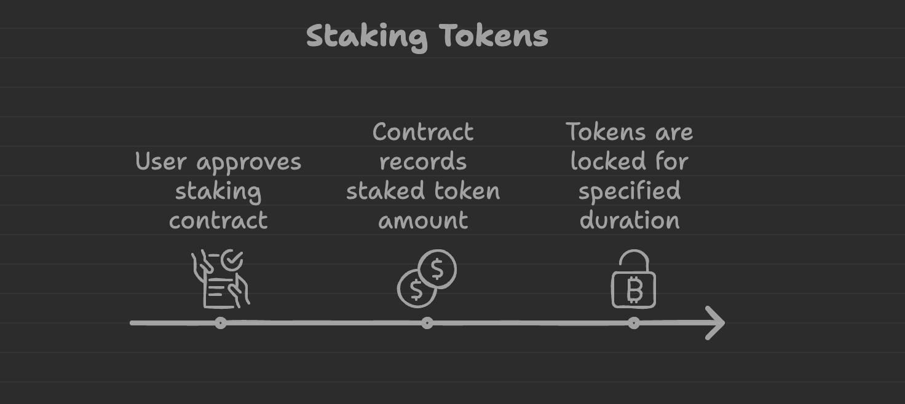
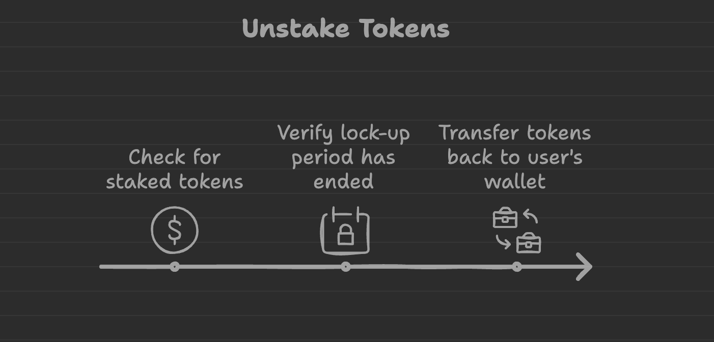
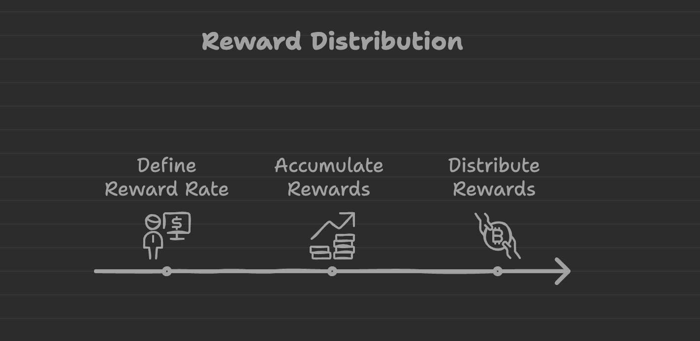

# Xây dựng ink! Staking contract

Ink Staking là một smart contract được phát triển bằng ink!, ngôn ngữ smart contract cho hệ sinh thái Polkadot. 
Dự án này nhằm cung cấp một cơ chế staking phi tập trung cho những người nắm giữ token, cho phép họ kiếm phần thưởng 
bằng cách tham gia vào giao thức staking của mạng lưới

Link code tham khảo: https://github.com/CocDap/ink-staking

Định nghĩa staking trong blockchain: https://gfiblockchain.com/lai-kep-tu-staking-giai-phap-toi-uu-loi-nhuan-khong-the-bo-qua.html


## PSP22 Token Contract 

Link code: https://github.com/CocDap/ink-staking/tree/main/psp22

### Phân tích code PSP22 

Phần này mình có phân tích rõ phần hướng dẫn section [Ink Nâng cao - Token Extension PSP22](../../ink_advance/token_extension_psp22)


## Staking Contract

Link code: https://github.com/CocDap/ink-staking/tree/main/staking


### Định nghĩa on-chain storage

**Phân tích:** 

Gồm có 2 trường dữ liệu chính: 
+ Dữ liệu staking: Gồm các thông tin lưu khi user stake token, reward , thời gian khoá token , ... 
+ Token Contract Address: Mục đích sử dụng token PSP22 để stake -> kiếm lợi nhuận 
(Cần phân biệt native tokens và tokens -> https://tangem.com/en/blog/post/what-is-the-difference-between-a-native-coin-and-a-token/)

Ví dụ: 
+ Một số dapps: https://www.alchemy.com/best/liquid-staking-platforms
+ Native tokens trên hệ sinh thái polkadot: Astar (https://portal.astar.network/astar/dapp-staking/discover) , Moonbeam (https://apps.moonbeam.network/moonbeam/staking)
+ Liquidity Staking là gì: https://coin68.com/liquid-staking-la-gi-tong-quan-ve-giai-phap-liquid-staking/


```rust
#[ink(storage)]
pub struct Staking {
    data: StakingData,
    token_contract: ink::contract_ref!(PSP22),
}
```
Link code: https://github.com/CocDap/ink-staking/blob/main/staking/lib.rs#L20

**Phân tích:** 

+ Lưu thông tin 1 user đã stake bao nhiêu tokens, thời gian deposit, thời gian unlock để nhận reward, nhận reward được bao nhiêu  -> `user_data: Mapping<AccountId, UserStakeData>`

+ Lưu user đã stake hay chưa -> `has_staked: Mapping<AccountId, bool>` 

+ Owner của smart contract staking -> `owner: Option<AccountId>` 

+ Lưu tất cả các user đã stake vào pool -> `stakers: Vec<AccountId>`

+ Tổng số lượng token đã staked -> `total_staked: u128` 

+ Tổng số lượng reward hiện tại -> `total_rewards: u128` 

+ Thời gian lock token -> `duration_time: Timestamp`

+ Tỉ lệ phần thưởng dựa trên lượng stake của user -> `reward_rate: u64` 

+ Phần thưởng chưa claim bởi user -> `pending_reward: Mapping<AccountId, u128>`


```rust
#[ink::storage_item]
#[derive(Debug, Default)]
pub struct StakingData {
    pub user_data: Mapping<AccountId, UserStakeData>,
    pub has_staked: Mapping<AccountId, bool>,
    pub owner: Option<AccountId>,
    pub stakers: Vec<AccountId>,
    pub total_staked: u128,
    pub total_rewards: u128,
    pub duration_time: Timestamp,
    pub reward_rate: u64,
    pub pending_reward: Mapping<AccountId, u128>,
}

#[derive(Debug, PartialEq, Eq, scale::Encode, scale::Decode, Default)]
#[cfg_attr(feature = "std", derive(StorageLayout, scale_info::TypeInfo))]
pub struct UserStakeData {
    pub amount: u128,
    pub deposit_time: Timestamp,
    pub unlock_time: Timestamp,
    pub claimed_reward: u128,
}
```

Link code: https://github.com/CocDap/ink-staking/blob/main/staking/data.rs#L36


### Hàm khởi tạo smart contact


**Phân tích code**

+ Khởi tạo thông tin Staking ban đầu với `owner` là đầu vào 

+ Khởi tạo `token contract` mà user sử dụng để staking


```rust
#[ink(constructor)]
pub fn new(owner: AccountId, token_contract: AccountId) -> Self {
    Self {
        data: StakingData::new(owner),
        token_contract: token_contract.into(),
    }
}
```

Link code: https://github.com/CocDap/ink-staking/blob/main/staking/lib.rs#L27


### Hàm `stake` 



**Phân tích code**
+ Transfer số lượng token vào `staking contract` 
+ Update thông tin khi user stake
+ Emit events 


```rust
#[ink(message)]
pub fn stake(&mut self, amount: u128) -> Result<(), StakingError> {
    let caller = self.env().caller();

    self.token_contract
        .transfer_from(
            caller,
            self.env().account_id(),
            amount,
            "Staking".as_bytes().to_vec(),
        )
        .unwrap();

    let events = self.data.internal_stake(caller, amount, self.time_now())?;
    self.emit_events(events);
    Ok(())
}

```

Link code: https://github.com/CocDap/ink-staking/blob/main/staking/lib.rs#L36


### Hàm `withdraw`




**Phân tích code**

+ Transfer số lượng token withdraw từ `staking contract` sang `user 
+ Update thông tin khi user withdraw 
+ Emit events 


```rust
#[ink(message)]
pub fn withdraw(&mut self, amount: u128) -> Result<(), StakingError> {
    let caller = self.env().caller();

    let (total_reward, events) =
        self.data
            .internal_unstake(caller, amount, self.time_now())?;

    self.token_contract
        .transfer(caller, amount.checked_add(total_reward).unwrap(), "Unstake".as_bytes().to_vec())
        .map_err(|_| StakingError::TransferFail)?;

    self.emit_events(events);

    Ok(())
}
```

Link code: https://github.com/CocDap/ink-staking/blob/main/staking/lib.rs#L54


### Hàm `claim_reward`




**Phân tích code**

+ Claim reward 
+ Update thông tin khi user sau khi claim reward 
+ Emit events 


```rust
#[ink(message)]
pub fn claim_reward(&mut self) -> Result<(), StakingError> {
    let caller = self.env().caller();


    let (total_reward, events) =
        self.data
            .internal_claim(caller, self.time_now())?;

    self.token_contract.transfer(
        caller,
        total_reward,
        "Reward".as_bytes().to_vec(),
    ).unwrap();

    self.emit_events(events);

    Ok(())
}
```

Link code: https://github.com/CocDap/ink-staking/blob/main/staking/lib.rs#L77


### Hàm `set_lock_time` 

**Phân tích code**

+ Chỉ có owner set được thời gian locking token 


```rust
#[ink(message)]
pub fn set_lock_time(&mut self, period: Timestamp){
    let caller = self.env().caller();

    assert!(caller == self.data.owner.unwrap(),"Not owner");

    self.data.duration_time = period;

}
```
Link code: https://github.com/CocDap/ink-staking/blob/main/staking/lib.rs#L97


### Các hàm QUERY

```rust
// Lấy tổng số lượng token đã staked
#[ink(message)]
pub fn get_total_staked(&self) -> u128 {
    self.data.get_total_staked()
}

// Lấy tổng lượng reward 
#[ink(message)]
pub fn get_total_reward(&self) -> u128 {
    self.data.get_total_reward()
}

// Lấy thông tin user data 
#[ink(message)]
pub fn get_user_data(&self, user: AccountId) -> UserStakeData {
    self.data.get_user_data_by_account(user)
}

// Lấy thông tin reward của một user 

#[ink(message)]
pub fn get_user_reward(&self, user: AccountId) -> u128 {
    self.data.get_user_reward(user, self.time_now())
}

// Lấy thông tin của tất cả các stakers 
#[ink(message)]
pub fn get_all_stakers(&self) -> Vec<AccountId> {
    self.data.get_all_stakers()
}

// Lấy thông tin deposit time của 1 user 
#[ink(message)]
pub fn start_time(&self, user: AccountId) -> Timestamp {
    let user_data = self.get_user_data(user);
    user_data.deposit_time
}

// Lấy thông tin locking period 
#[ink(message)]
pub fn duration_time(&self) -> Timestamp {
    self.data.duration_time
}

// Lấy thông tin thời gian kết thúc của locking 
#[ink(message)]
pub fn end_time(&self, user: AccountId) -> Timestamp {
    self.start_time(user).checked_add(self.duration_time()).unwrap()
}

// Lấy thông tin thời gian còn lại 
#[ink(message)]
pub fn time_remaining(&self, user: AccountId) -> Timestamp {
    if self.time_now() < self.end_time(user) {
        self.end_time(user).checked_sub(self.time_now()).unwrap()
    } else {
        0
    }
}
```

Link code: https://github.com/CocDap/ink-staking/blob/main/staking/lib.rs#L106


## Build contract PSP22 và Staking Contract 
Yêu cầu: có cài đặt `cargo contract` 

Chạy câu lệnh: 

```bash
./scripts/build.sh
```

Link code: https://github.com/CocDap/ink-staking/blob/main/scripts/build.sh


## Deploy contract PSP22 và Staking Contract 


Bạn có thể sử dụng 1 trong các tool để deploy ink! contract như sau: 
+ Contract UI: [Contract UI](../../ink_basic/contract_template#sử-dụng-ink-cli-aleph-zero-testnet)
+ POP CLI: [POP](../../ink_basic/contract_template#s%E1%BB%AD-d%E1%BB%A5ng-pop-cli-aleph-zero-testnet)
+ INK! CLI : [Ink! CLI](../../ink_basic/contract_template#s%E1%BB%AD-d%E1%BB%A5ng-contract-ui-deploy-tr%C3%AAn-pop-network-testnet)


## Tài liệu tham khảo 

+ https://github.com/CocDap/ink-staking
